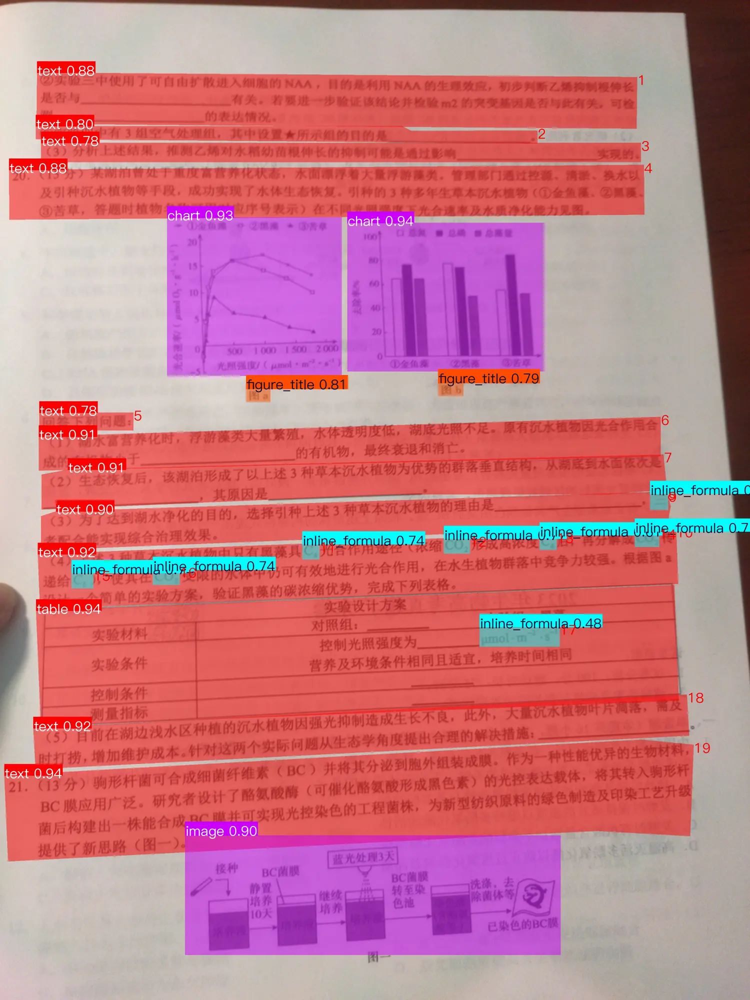
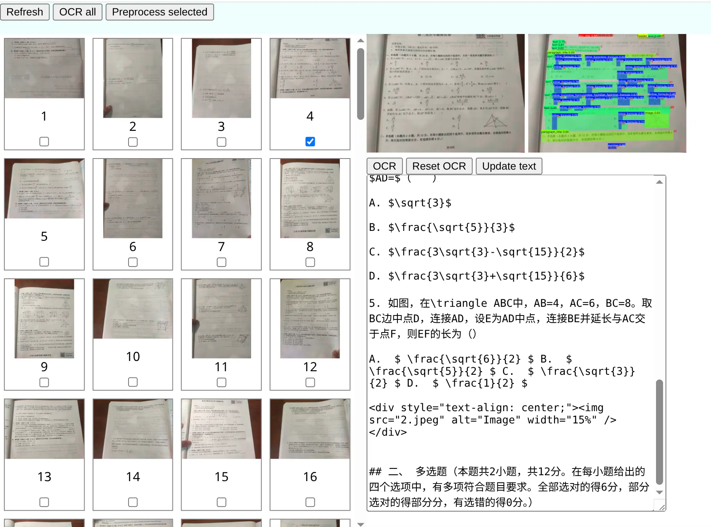
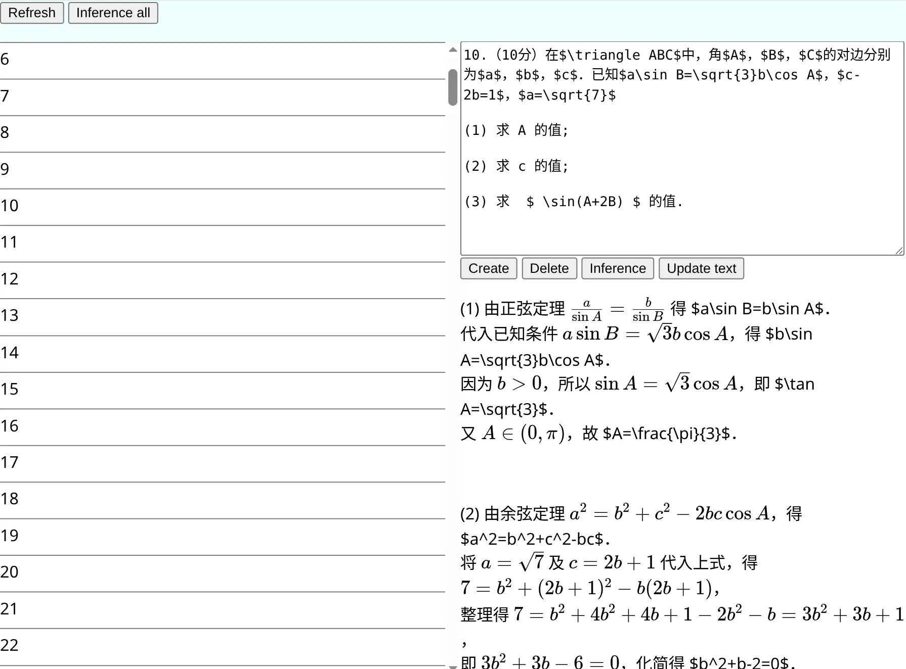

## 前情提要

2026 年年初那个寒假，我做出了“作业管线v1”：

1. 用手机拍照
2. 用 PaddleOCR-VL 把作业识别成 Markdown
3. 手动修正 OCR 的错误
4. 用 llama.cpp 本地部署 Qwen3-VL
5. 用 llama-server 自带的 WebUI ，把 Markdown 喂给 AI
6. 写字

当时的 llama.cpp 还有 bug ，开一个新的对话，对话的 context 是清除了，但是输出速度就跟没清除 context 一样，随着对话变多，输出速度越来越慢，不得不隔一段时间就重启 server 。

---

时隔一个学期，暑假，升高三，作业非常多，我肯定也是要AI帮我写的。现在AI的发展可以说是日新月异，我也要升级一下我的管线。

## PaddleOCR

PaddleOCR-VL 虽然精度很高，但是，它很慢，在 RTX 5060 Laptop 上都慢，更别说我的 Radeon 780M —— 不是性能差，而是PaddlePaddle不支持 Vulkan ，只能用 CPU 。

首先，安装 uv：

```shell
curl -LsSf https://astral.sh/uv/install.sh | sh
```

然后创建虚拟环境，安装依赖：

```shell
mkdir paddle
cd paddle
uv venv
. .venv/bin/activate
uv pip install paddleocr onnxruntime
```

可以切换到国内镜像，创建`~/.config/uv/uv.toml`

```toml
[[index]]
url = "https://mirrors.tuna.tsinghua.edu.cn/pypi/web/simple/"
default = true
```

安装 PaddleOCR ，选择 onnxruntime ，因为之前用 PaddlePaddle 时出现过依赖问题，而且 PaddlePaddle 很大，有 180MB 。

```shell
uv pip install paddleocr onnxruntime
```

识别图片：

```shell
paddleocr ocr -i input.png --engine onnxruntime --save_path output
```

它会自动开始下载模型，默认是 PP-OCRv6 的 medium 模型，有文本检测 (det) 模型和文本识别 (rec) 模型，加起来 120MB 左右。
模型下载完后开始识别，然后在 output 目录能看到输出的图片和 json 。

PP-OCR 虽快，但是，识别不了图片和表格，只能识别纯文本，也不能输出 markdown ，只有 json 。所以，还是得用 PaddleOCR-VL ，那还是得安装 PaddlePaddle 。
官方推荐 Docker ，但是我讨厌 Docker ，因为它很臃肿，而且我本来就是 Linux 了，没有 Windows 的各种问题，直接安装就挺好。

```shell
uv pip install paddlepaddle -i https://www.paddlepaddle.org.cn/packages/stable/cpu/
uv pip install paddleocr[doc-parser]
```

开始识别：

```shell
paddleocr doc_parser -i /input.jpg --save_path output
```

又是漫长的等待，要下载1.8GB的模型，比PP-OCR大太多。下载完后开始识别，报错：

```text
ValueError: No valid model files were found for engine 'paddle_dynamic'.
```

再去`~/.paddlex/official_models/PaddleOCR-VL-1.6`一看，没有`model.safetensors`，往上翻命令行输出，果然是网络问题，下载失败了。

在等待下载期间，我在它的[文档](https://www.paddleocr.ai/latest/version3.x/pipeline_usage/PaddleOCR-VL.html#313)里看到，PaddleOCR-VL 的 VLM 推理部分有 GGUF 模型，支持 llama.cpp 运行，这不就支持 Vulkan 了吗，于是我就没再重新下载，直接去 Hugging face [下载模型](https://huggingface.co/PaddlePaddle/PaddleOCR-VL-1.6-GGUF/tree/main)，模型 GGUF 和 mmproj 加起来，也要 1.8GB 左右。后来嫌 Hugging face 下载太慢，换成了 ModelScope 。

启动 llama-server：

```shell
llama-server -m PaddleOCR-VL-1.6-GGUF.gguf \
    --mmproj PaddleOCR-VL-1.6-GGUF-mmproj.gguf \
    -ngl 99 --port 8100 --temp 0
```

它默认开启缓存，可以通过`--cache-ram 0`关闭，关闭缓存对性能影响不大。

开始 OCR ：

```shell
paddleocr doc_parser -i input.jpg \
    --vl_rec_backend llama-cpp-server \
    --vl_rec_server_url http://localhost:8100/v1 \
    --vl_rec_api_model_name 'PaddlePaddle/PaddleOCR-VL-1.6' \
    --save_path output
```

报错：`ModuleNotFoundError: No module named 'docx'`，不用管。

PaddleOCR 的 python 程序会先做版面分析，获取每一个文本块的位置，然后把每一个文本块交给 VLM 识别。所以用 PaddleOCR 识别一个图片，在 llama.cpp 的日志里能看到多个请求。

耗时大约 30s ，这还是电池供电+省电模式的耗时，插电+性能模式肯定更快。可视化的识别结果是这样的：



这里必须吐槽，学校的一些作业，纸太薄了，背面的字会透过来，十分影响 OCR 效果，而且这种还不好给 AI 来处理，只能自己挨个检查，然后删掉误识别的文本。

安装 PaddleX 服务器：

```shell
uv pip install pip # paddlex需要这个
paddlex --install serving
```

导出默认配置：

```shell
paddlex --get_pipeline_config PaddleOCR-VL
```

它会询问保存位置，直接按 Enter ，默认保存到`./PaddleOCR-VL.yaml`。

编辑配置：

```patch
--- PaddleOCR-VL.yaml.old
+++ PaddleOCR-VL.yaml
@@ -22,7 +22,7 @@
 SubModules:
   LayoutDetection:
     module_name: layout_detection
-    model_name: PP-DocLayoutV2
+    model_name: PP-DocLayoutV3
     model_dir: null
     batch_size: 8
     threshold: 
@@ -85,7 +85,9 @@
     model_dir: null
     batch_size: -1
     genai_config:
-      backend: native
+      backend: llama-cpp-server
+      server_url: http://localhost:8100/v1
+      api_model_name: PaddlePaddle/PaddleOCR-VL-1.6
 
 SubPipelines:
   DocPreprocessor:
```

启动服务器：

```shell
paddlex --serve --pipeline ./PaddleOCR-VL.yaml --port 8101
```

写一个 Javascript 来测试：

```js
import * as fs from "node:fs"
const API_URL = "http://localhost:8101/layout-parsing"
const imagePath = "input.jpg"
const buf = fs.readFileSync(imagePath)
const request = {
    file: buf.toString("base64"),
    fileType: 1
}
const response = await fetch(API_URL, {
    method: "POST",
    headers: {
        "Content-Type": "application/json", // 必要，否则会报错
    },
    body: JSON.stringify(request),
})
const json = await response.json()
console.log(json)
```

返回一个 JSON 对象，包含 OCR 结果。

识别一个图片的时间在 10s ~ 50s 之间，图片越复杂，处理时间越长。

后来处理时发现一些小问题，比如“甲”识别成“印”，“乙”识别成“2”，“丁”识别成“T”，也是后悔拍照的时候手太抖了，拍花了又没重新拍。寒假的时候还架一个三脚架来拍，这次懒了，直接手持手机拍的。

## 文本预处理

在让 AI 真正做题之前，我要用一个轻量的 LLM 做文本预处理：

- 表格的`<td>`的`style`属性可以删掉，没有`rowspan`和`colspan`的表格可以直接转为 Markdown 表格。
- 被`<div>`包裹的``，需要去除`<div>`，只保留``。
- 删除掉题目无关内容，比如页码、“扫码提交答案”等。
- 一页有多个题目，可以拆分。
- 拆分后，识别题目的科目和类型（选择、填空、解答），方便我看。
- 最后输出 JSON 。

也有时候，一个题目跨两页，需要合并，这个我就自己做了。在我自己写的前端里选择含有连续题目的多页，给预处理 AI 拆题。

模型我选择的是 [Qwen3.5-4B-GGUF](https://huggingface.co/unsloth/Qwen3.5-4B-GGUF) ，IQ4_NL 量化。同样用 llama-server 部署：

```shell
llama-server -m Qwen3.5/Qwen3.5-4B-IQ4_NL.gguf \
    -ngl 99 --ctx-size 8192 --reasoning off --alias qwen --port 8103
```

模型支持 multimodal ，但我用不着，所以不加载 mmproj 文件。模型默认启用 reasoning ，浪费时间，用`--reasoning off`关掉。

让 AI 帮我写了一个 system prompt 。prompt 比较长，就不放在这了。

看似简单，但是后来出现了一个问题：PaddleOCR 识别出的 LaTeX 含有大量`\`转义符号，然后我又要求 LLM 输出 JSON ，JSON又要求把`\`转义成`\\`，它有时候会卡住，不停地输出反斜杠。所以，我把它拆成了两步：

1. 处理表格和``，输出 Markdown 。
2. 把第一步获得的 Markdown 再给它拆题，输出仍然是 JSON ，但不含题目内容，而是每个题在输入字符串中的偏移量。

但再一想，LLM 数字符也不可靠。所以我就在输入中加标记：

```text
@@000@@
1. 以下说法正确的是（）
@@001@@
A. 1+1=1
@@002@@
B. 1+1=2
```

让 AI 输出标记的数字，我再在代码里拆分。

但是，它十分不稳定。有时候会把选择题的每个选项都识别成一道题，有时候漏题目，只有选项。然后识别的科目也时常会错，数学识别成物理我就不说了，但数学识别成生物，肯定是有问题的。

于是我把模型换成了 DeepSeek-R1-Distill-Llama-8B-Q4_K_M.gguf ，效果还更差。那没办法，拿出最终模型 Qwen3.6-35B-A3B-UD-IQ4_NL.gguf ，效果改善了很多。

但是，它还是不好用，它有时候会漏图片，还是得人工检查。所以，最后还是我手动预处理的。

## 做题

我选择的模型是 [Qwen3.6-35B-A3B-MTP-GGUF](https://huggingface.co/unsloth/Qwen3.6-35B-A3B-MTP-GGUF) ，UD-IQ4_NL 量化。MoE 模型，占用的 RAM 跟 35B 的模型一样，但是推理速度比 35B 的模型快。

我有 32GB 的 RAM ，但不像 MacBook ，我的 iGPU 能分配到的内存很少，即使把 context size 降低到 8192 ，也不能把所有 layer 放到 GPU 上运行，只能用`-ngl 30`或更低。

```shell
llama-server -m Qwen3.6-35B-A3B-UD-IQ4_NL.gguf --mmproj mmproj-F16.gguf \
    --no-mmproj-offload -ngl 30 --ctx-size 8192 --cache-ram 0 --reasoning-format deepseek
```

因为它本来占的内存就多，内存不太够用，所以用`--cache-ram 0`关闭缓存。

因为图片不多，用`--no-mmproj-offload`参数，把 mmproj 给 CPU 运算，可以腾出更多显存给模型本身，`-ngl`也就可以大一些。

后来我嫌它太慢，用`--reasoning off`关闭了思考，但是精度大幅降低，而且部分题目的思考过程还是会出现，不符合我的 system prompt 的要求。上面的预处理精度低，应该也是因为关闭了思考。看来 reasoning model 关掉 reasoning 就几乎没法用。果然，还是性能限制了我的想象力。

## 管线

一共 100 多张图片，手动复制粘贴太麻烦，所以写一个程序来自动化这个过程，这也是整个管线的核心。

```text
 --- 数据库 --------------------------------
|                                          |
| 图片--  > Markdown -    ----> 题目 -----   |
|      | |           |   |              |  |
 ------------------------------------------
       | |           |   |              |
       OCR           预处理             做题
        |              | < OpenAI API > |
     PaddleX      llama-server     llama-server
        |              |                |
    llama-server   Qwen3.5-4B    Qwen3.6-35B-A3B
        |
 PaddleOCR-VL-1.6
```

主要是数据库和 HTTP 请求，所以选择了 Typescript 。

写一个简单的前端，用来查看 OCR 结果和题目推理结果。





（临时用一下，前端做的不太好看）

管线的代码都是开源的：[链接](https://github.com/BinTianqi/HomeworkPipeline)。

### Deno 生态

我之前一直是用 node 作为 Javascript runtime ，这次使用了 deno ，觉得非常好用。

deno 相比 node ，优点还是挺多的：

- 有 Language server ，可以配合 VSCode 插件实现代码格式化。
- 对 Typescript 的支持很好。
- 包管理器比 npm 好用。
- ......

bun 可能更好，~~但 bun 可能会变质~~。

## 总结

要不是作业非常多，我也不会想着去做这个。最后总时间算下来，可能比我自己写作业的时间还长。不过这个折腾还是挺好玩的。
在我的同学还在为作业帮的实名认证发愁时，我已经本地部署AI帮我写作业了。