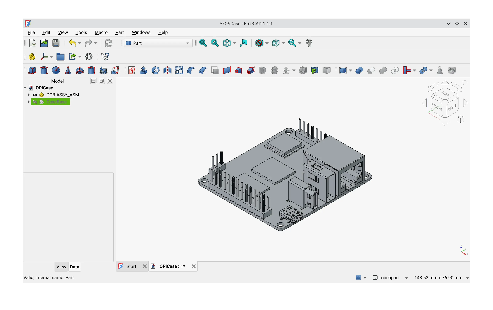
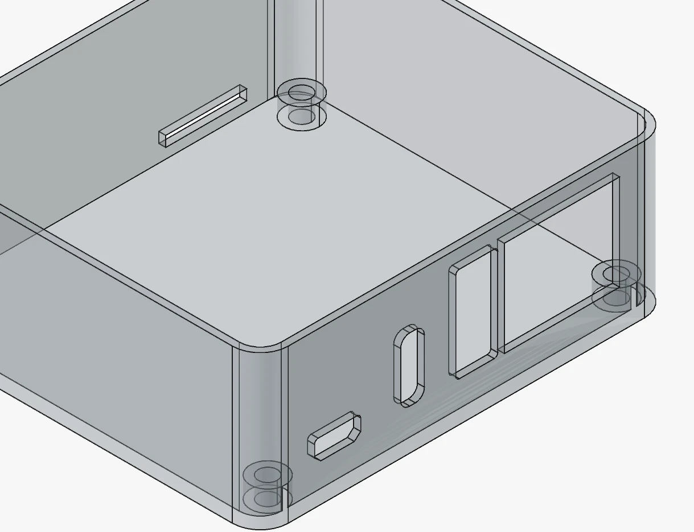
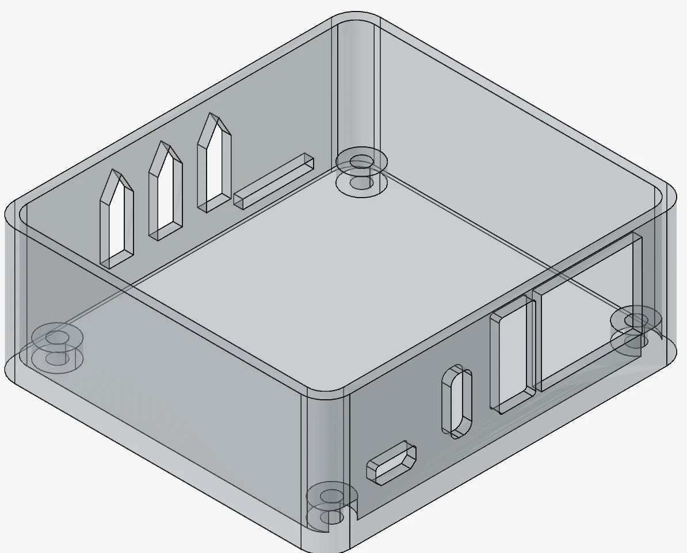
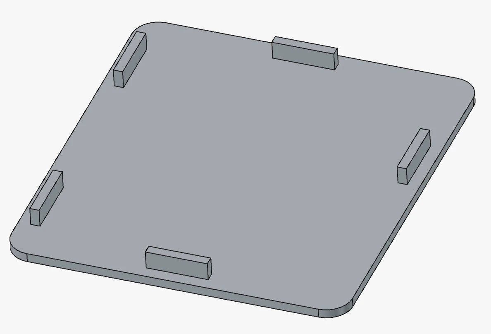
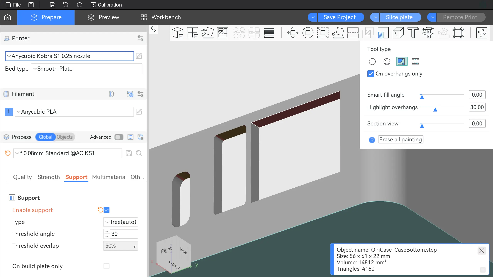
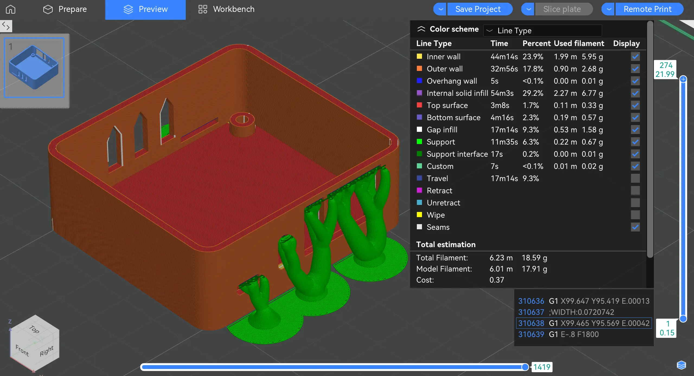
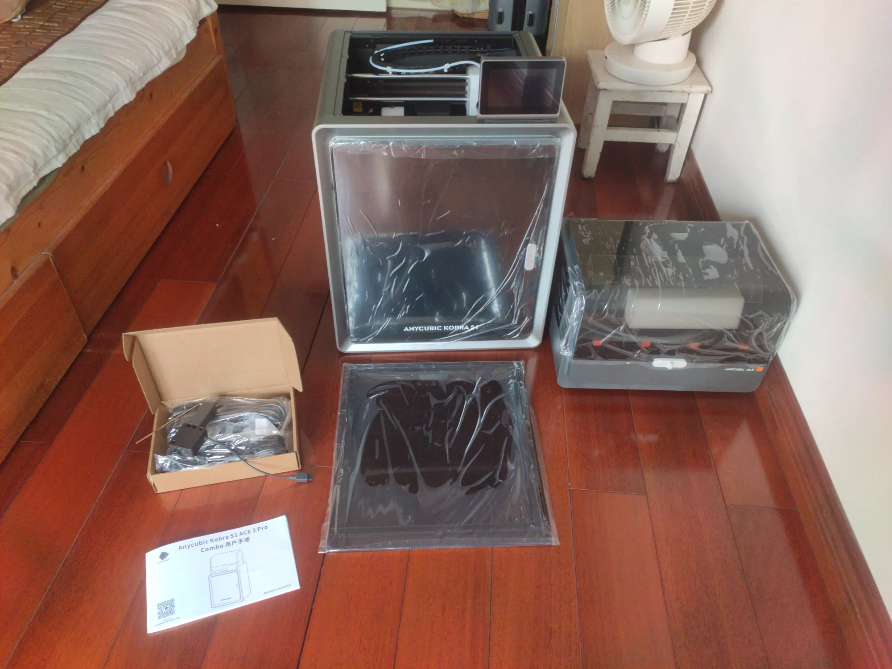
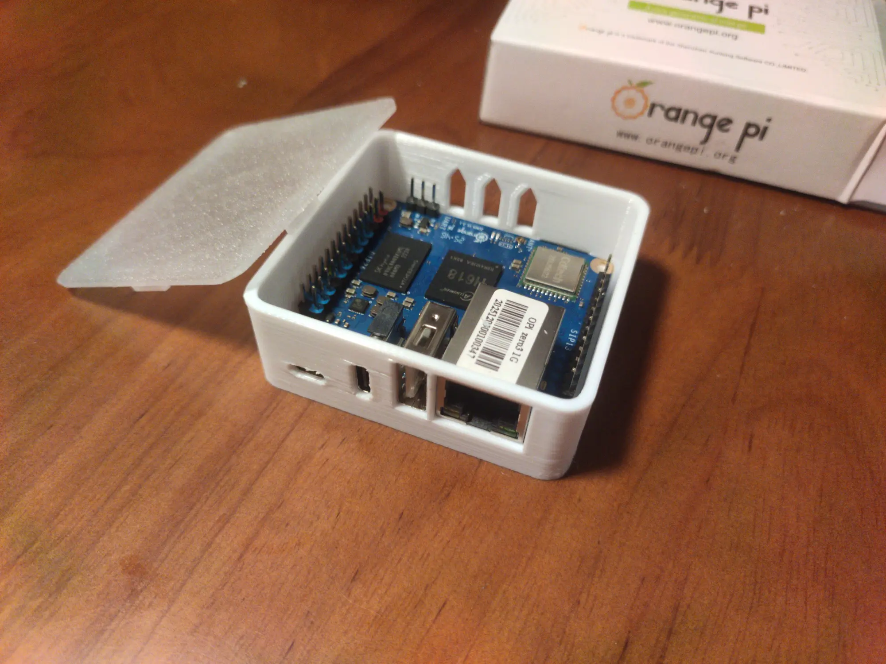

暑假，我要 DIY 很多东西，于是我买了一台 3D 打印机——纵维立方 S1C ，并自己设计了一个香橙派 Zero 3 的外壳，然后打印。

自从买了香橙派 Zero 3（以下简称 OPi ）之后，一直把它放在包装盒里用，但是这有两个问题：第一，纸盒不美观、不结实；第二，插U盘不方便，得手扶着 PCB ，容易碰到上面的电子元件，只能用延长线解决。

## CAD

2026/6/20，开始设计外壳。

Debian的APT里面有`freecad`包，我用的版本是 1.1.1 。

首先下载开发板的模型。打开 [Orange Pi 官网的这个页面](http://www.orangepi.org/html/hardWare/computerAndMicrocontrollers/service-and-support/Orange-Pi-Zero-3.html)（用的英文官网，因为中文官网用💩百度网盘），下载 Mechanical ，解压，打开 FreeCAD ，创建空白文档，导入那个 stp 文件。那两个 dxf 文件是焊盘的 2D 图像，对于做外壳来说没啥用，忽略。



FreeCAD 的右下角可以选择 Navigation style ，我选择的是Touchpad。

### 基础外壳

创建一个 Part 。

创建 Sketch 。使用圆角矩形工具，随便点一个地方，输入长度和宽度，OPi 的大小是 50x55mm ，要留出一点空隙，四边都留 1mm ，再留出外壳的厚度，2mm ，所以圆角矩形的大小是 56x61mm 。PCB的圆角半径是 2mm（通过通过Tools->Measure测得），算上和 PCB 之间那 1mm 空隙和 2mm 厚度，那么外壳内侧的圆角半径就应该是 3mm ，外侧的 5mm 。

居中圆角矩形。选中长度为 56mm 的一个边，再选中和它平行的那个坐标轴，使用 Dimension constraint ，在它的下拉菜单中选择 Distance dimension ，把鼠标放在刚刚选中的那两条线之间，单击，在对话框中输入 30.5mm（ 61mm 的一半），确定。另一条边同理。

切换到 Part Design 工作台，选择创建好的 Sketch ，使用 Pad 工具，把它变成立体的，高度暂时设为 20mm 。

接下来要“切掉”外壳中间的部分。选中立方体的顶面，创建 Sketch ，创建圆角矩形，大小 52x57mm ，圆角半径 3mm 。居中之后回到 Part Design ，选中 Sketch ，使用 Pocket 工具，高度 18mm 。

在树中右键单击 Part ，点 Toggle transparency ，可以把 Part 变成半透明的，方便观察。

再右键单击 Part ，点 Transform ，调整外壳的位置。

### 螺柱

在上视图，把 PCB 模型隐藏，选择盒子底部，创建 Sketch ，先点工具栏的 Toggle construction geometry ，这样创建出来用于定位的矩形就不会在 Pad 的时候出现，construction 的矩形是虚线的。创建矩形，尺寸 45.06x49.94mm ，也就是是螺丝孔的间距。

再点一次 Toggle construction geometry ，切换回普通模式，使用圆形工具，把鼠标放在矩形的一个顶点上，出现准心图标后单击，创建圆形，直径 5mm ，也就是 3mm 的孔径再加 1mm 的螺柱厚度。重复 4 次，创建 4 个圆。后面的 3 个圆不需要指定直径，选中 4 个圆，加上 Equal constraint 就行。

回到 Part Design 工作台，Pad ，PCB 背面最高的元件是那个 SPI flash ，2mm ，那螺柱就高 3mm 。

一开始我是不想打孔的，因为没有螺纹，拧螺丝麻烦，我就在螺柱上再创建 4 个凸出来的小柱子，可以卡住 PCB ，但是我后来觉得不稳固，就选择了打孔。

选择任意一个螺柱的顶面，创建 Sketch ，过程和创建螺柱几乎一样，唯一的区别就是圆的直径是 2.7mm 。然后再 Part Design 模式用 Pocket 工具打洞，深度 3mm 。

### IO 接口打孔

同样，在盒子侧面创建 Sketch 。Skecter 里面有一个工具叫 External projection ，我本来想用它把 PCB 上的接口投影到 Sketch 上，但是它不能从不同 part 上选择线，不过确实不应该用 projection ，我希望 PCB 模型删了之后这些接口的开孔还在，那就自己切换到侧视图，照着接口的边缘画线。和接口留出 0.1mm 的空隙，因为留少了能磨掉，留多了很难补上。

另一侧的 TF 卡也要打孔。

OPi 的 IO 接口都是超出 PCB 1mm 的，所以，把螺柱往 IO 接口那里移 1mm ，让 OPi 的 IO 接口从孔里面穿出去。



### 散热孔

在后面画 Sketch ，此处的开孔顶部用三角形，3D 打印时无须支撑。



### 顶盖

创建 Part ，在 Part 中创建 Body ，在 Body 中创建 Sketch ，在 Sketch 中创建圆角矩形，和盒子一样大，56x61mm ，然后 Pad ，高度 1.5mm 。

选中 Pad 后的物体的一个面，创建 Sketch ，画出用于固定顶盖的几个矩形，然后 Pad ，高度 2mm 。



完成！导出 step 文件，准备切片。

分享我的 FreeCAD 工程：[OPiCase.FCStd](./OPiCase.FCStd)

## 切片

在下单 3D 打印机后，我就开始切片了。

去[官网](https://anycubic.com/zh/slicerNextDownload)下载 Anycubic Slicer Next ，以下简称 ASN 。下载 Windows 版（ Linux 版后面再说），照着指引安装。在Setup wizard 里选择 Anycubic S1 。它的主页会显示 Makeronline（纵维立方社区）的推荐模型，关不掉，但是可以在设置里把默认页面改为 prepare ，这样启动时就不会打开首页。

创建新项目，导入 step ，直接 Slice plate ，开始切片。默认不会生成任何支撑，在左侧边栏，Process -> Support -> Enable support 。用自动支撑，默认参数，不管是树状还是普通，它就是不给我的 Micro HDMI 接口生成支撑，只能手动。

回到准备工作区，选中物体，使用上方工具栏的 Support painter 工具，Tool type 选择 Fill（第三个），Smart fill angle 设为 0 ，勾选 On overhangs only ，从下往上看，那些悬空的地方会被高亮，点一下，就会在切片时生成支撑。



在左侧边栏里把支撑类型改成 Tree (manual) ，切片。它会在模型里面生成支撑，可以通过启用 On build plate only ，仅在热床上生成支撑。

墙壁需要实心，把 Strength -> Infill -> Sparse infill density ，设置成100%。

切片，完成。



## 打印

看了一圈，我能找到的相对便宜的封闭式的 CoreXY 打印机，就是纵维立方的 S1C ，S1C 是 S1 + ACE（ Anycubic Color Engine ，它的4色耗材盒子）的简称。2200块，能接受。

### 打印机安装

拆箱，打印机非常重。



照着说明书，拧下两个固定螺丝，从机器里面取出 ACE，再卸下4个螺丝，取出 ACE 的固定板，再拆下3个螺丝，解锁热床。安装东西要装螺丝的，我见的太多，但是要拆螺丝的，我是第一次见。如果换成卡扣，肯定更好。

安装四合一进料口，然后把 ACE 放在机器顶上，接好 ACE 和打印机之间的数据线和料管。

我没想到的是，ACE 竟然要单独的 220V 供电，而不是打印机给 ACE 供电。虽然 ACE 有烘干功能，功率比较大，它背后写着额定功率 300W ，但也不至于要单独 220V 供电的地步吧。我宁可牺牲边烘干边打印的功能也不愿意插两个 220V 供电，就是因为这个我才不得不用排插。

开机。第一次开机会自动校准，要等几分钟。

它也没送一个接废料的盒子，我还得自己找。

### 打印

一定要剪掉料盘上耗材的开头那一小段，它是弯折的，不剪掉就会在进料的时候卡住。

先打印下面的，没有任何问题。打印完，在屏幕上把几个风扇都开到最大，等热床冷却下来后去掰打印出来的 OPi 外壳，用点力，可以掰下来。

然后打印顶盖，出现了堵料，我停止打印，在小屏幕上把打印头温度升到 160°C ，用手从打印头上取下卡住的耗材。顶盖很薄，不好用手掰，得拿小刀撬。

我的打印出来的外壳，IO开孔的大小和位置是没有问题的，但是OPi的IO接口焊歪了，所以我得拿小刀把开孔开得大一些，OPi的接口才能从孔里穿出去。

最后结果：



## 安装Linux版

OrcaSlicer 提供了 AppImage ，Linux 可以用，它也支持纵维立方的打印机，但肯定没有从 ACE 同步耗材信息等功能。

我在 Windows 系统里面打印的，打印完了才开始研究 ASN 的编译，编译失败了才研究安装官方构建好的二进制。因为编译失败了，所以那一部分放在博客的结尾。

我看纵维立方的 [wiki](https://wiki.anycubic.com/en/software-and-app/anycubic-slicer-next-linux) ，它给了一个安装脚本，我从里面拿到了 apt 仓库的 URL ，把它放到`/etc/apt/sources.list.d/anycubic.sources`

```text
Types: deb
URIs: https://cdn-platform-slicer.anycubicloud.com/prod
Suites: forky
Components: main
Trusted: yes
```

`apt update`的时候报错：

```text
Err:1 https://cdn-platform-slicer.anycubicloud.com/prod forky InRelease
  403  Forbidden [IP: 27.37.205.50 443]
```

我找到了 [develonrails/anycubic-slicer-next](https://github.com/develonrails/anycubic-slicer-next) 仓库，它的 Releases 里面提供了 AppImage ，不过我想看看它的 AppImage 是从哪来的。

它的 [appimage/HOWTO.md](https://github.com/develonrails/anycubic-slicer-next/blob/main/appimage/HOWTO.md) 里面有一行：

```shell
curl -s https://cdn-universe-slicer.anycubic.com/prod/dists/noble/main/binary-amd64/Packages
```

（ Anycubic 的 apt 仓库分国内和全球两个 CDN ，它用的是全球的，我用国内的）

我试着 curl 了一下，返回 200 ，文件内容是 deb 包的信息。

我把它 URL 里的`noble`（ Ubuntu 24 的代号）替换成`forky`（我用的 Debian 14 的代号），返回 403 。

你找不到文件你就返回 404 Not found 啊，搞个 403 Forbidden 是什么意思？我还以为是 CDN 出问题了。

把`anycubic.sources`的`Suites: forky`改成`Suites: noble`，再`apt update`，虽然有两个 warning ，但是没有影响，接着`sudo apt install anycubicslicernext`，报错：

```text
Error: Unable to satisfy dependencies. Reached two conflicting assignments:
   1. anycubicslicernext:amd64=1.3.96 is selected for install
   2. anycubicslicernext:amd64 Depends libsoup-2.4-1 (>= 2.74.3)
      but none of the choices are installable:
      [no choices]
```

这我是真没办法了，只能去用它提供的 AppImage 了，下载的 AppImage 能用。

它的 Windows 版和 Linux 版的行为还太不一样，Windows 版不能自动给 Micro HDMI 生成支撑树，而 Linux 版可以。

## 编译

既然是开源的，那我可以自己编译。

```shell
git clone --depth=1 --recursive https://github.com/ANYCUBIC-3D/AnycubicSlicerNext.git
```

需要下载大概 94MB 。

ASN 没有提供编译文档，去看上游 [OrcaSlicer 的编译文档](https://www.orcaslicer.com/wiki/developer_reference/how_to_build#linux)。

```shell
cd AnycubicSlicerNext
./build_linux.sh -u
```

它开始调用 apt 安装依赖，报错：

```text
Error: Unable to locate package libgstreamerd-3-dev
```

先`sudo apt install libgstreamer1.0-dev`，然后直接编辑`scripts/linux.d/debian`文件，删除`libgstreamerd-3-dev`这一行，再`./build_linux.sh -u`，顺利安装，不再报错。

接着用`./build_linux.sh -d`编译依赖，这时候才开始运行 CMake 。它的构建系统相当复杂，configure 时要还下载很多依赖，看 xray 的日志，几乎都是访问 GitHub 下载的，看 vnstat ，整个过程要下载 600 多 MB 的东西。下载完之后自动开始编译依赖，编译完后，整个项目目录增加到 6.6GB 。

接着用`./build_linux -s`编译程序，报错：`ninja: error: unknown target 'AnycubicSlicerNext'`

大概是它把 target 的名字改成了 AnycubicSlicerNext ，但是有些地方没改。

用 CMake 列出所有 target ：`cmake --build . --target help`，输出了一根很长的列表，根本没法看。

那生成一个 graph ：`cmake --graphviz=deps.graph -B build`，然后`sudo apt install graphviz`，最后生成 svg ：`dot -Tsvg deps.graph > deps.svg`。

它的依赖关系非常复杂，svg 有 30000x1800px 。在中间偏右的最顶部找到 target ：`OrcaSlicer`。

编辑`build_linux.sh`，跳转到第247行左右，把4个`AnycubicSlicerNext`替换成`OrcaSlicer`。

运行`./build_linux.sh -s`，报错：

```text
ninja: error: '/home/tanky/prog/AnycubicSlicerNext/deps/build/destdir/usr/local/lib/libwx_gtk3u_media-3.1.a',
needed by 'src/Debug/orca-slicer', missing and no known rule to make it
```

缺少依赖了？再次运行`./build_linux.sh -d`，看到它重新安装了一些 wx 相关依赖，再编译，还是同样的报错。

估计是 GStreamer 的问题。`sudo apt install gstreamer1.0-plugins-base`，再`./build_linux.sh -d`，`./build_linux.sh -s`，终于开始编译了。编译过程中很多 warning ，它没给 gcc 开颜色输出，我还在担心那些是不是 error ，不过总算是顺利编译完了。

生成 AppImage ：`./build_linux.sh -i`，它会自动下载 appimagetool ，最后生成`build/OrcaSlicer_Linux_V2.3.1.AppImage`。

完成！

运行程序，splash 屏幕是 OrcaSlicer 的，跟我之前在 Windows 里的 ASN 不一样，再结合我之前在 GitHub 上看到，它最后一次 commit 是几个月前，不会是假开源吧？我被骗了？

切换到 ASN 的`develop`分支，它比`main`分支领先214个 commit ，可能包含了最新的更改。

```shell
git restore .
git clean -f
git fetch --depth=1 origin develop:develop
```

然后再修改`scripts/linux.d/debian`，运行`./build_linux.sh -d`，安装依赖，失败。清除依赖目录，重新安装依赖：

```shell
rm -rf deps/build
./build_linux.sh -d
```

不知道它的依赖缓存在哪里，这次只下载了部分依赖。卡在一个地方很久，然后报错：

```text
CMake Error at /home/tanky/prog/AnycubicSlicerNext/deps/build/dep_wxWidgets-prefix/tmp/dep_wxWidgets-gitclone.cmake:50 (message):
  Failed to clone repository:
  'http://192.168.2.20/r/~liuchunlin/dep_orca_wxwidgets.git'
```

为什么要请求局域网地址啊？`grep -r 192.168.2.20`，找到了`deps/wxWidgets/wxWidgets.cmake`，第26行左右：

```cmake
AnycubicSlicer_add_cmake_project(
    wxWidgets
    GIT_REPOSITORY "http://192.168.2.20/r/~liuchunlin/dep_orca_wxwidgets.git"
    GIT_SHALLOW ON
    # ...
)
```

参考main分支，把它改回`https://github.com/SoftFever/Orca-deps-wxWidgets`，再安装依赖，报错：

```
CMake Error at WebView/CMakeLists.txt:7 (find_package):
  Could not find a package configuration file provided by "wxWidgets"
  (requested version 3.3) with any of the following names:

    wxWidgets.cps
    wxwidgets.cps
    wxWidgetsConfig.cmake
    wxwidgets-config.cmake
```

缺文件，应该是改了 wxWidgets 库。在我以为它真的是假开源的时候，我找到了这个 repo ： [ANYCUBIC-3D/dep_wxwidgets](https://github.com/ANYCUBIC-3D/dep_wxwidgets) ，应该是它了。修改`deps/wxWidgets/wxWidgets.cmake`，把 URL 换成`https://github.com/ANYCUBIC-3D/dep_wxwidgets.git`，再安装依赖，还是同样的报错。

`dep_wxwidgets`的默认分支是`local_src`，它还有一个`master`分支，比`local_src`领先7个 commit ，切换到它试试。

它给 CMake 的`ExternalProject_Add`做了一个 wrapper ，`AnycubicSlicer_add_cmake_project`，不支持`GIT_TAG`参数。修改`deps/CMakeLists.txt`：

```cmake
# 115行左右
function(AnycubicSlicer_add_cmake_project projectname)
    # 在`GIT_REPOSITORY`后面添加`GIT_TAG`
    cmake_parse_arguments(P_ARGS "" "INSTALL_DIR;BUILD_COMMAND;INSTALL_COMMAND;URL;GIT_REPOSITORY;GIT_TAG" "CMAKE_ARGS" ${ARGN})
    # ...
    ExternalProject_add(
        # ...
        # 158行左右
        GIT_TAG ${P_ARGS_GIT_TAG}
    )
endfunction()
```

再修改`deps/wxWidgets/wxWidgets.cmake`，加上`GIT_TAG master`，再安装依赖，wxWidgets 没有报错了，但它的`dep_OpenPlugins`构建失败，有代码写错了。唉，finally another error message 。

正在绝望之际，我在 ASN 的 repo 里看到了`BuildLinux.sh`，十分显眼，因为 commit message 是中文的，运行，报错`Your distribution does not appear to be currently supported by these build scripts`。

它的脚本有 bug ，改一下：

```patch
diff --git a/BuildLinux.sh b/BuildLinux.sh
index b90033b..15b0230 100755
--- a/BuildLinux.sh
+++ b/BuildLinux.sh
@@ -124,12 +124,12 @@ if [ "${DISTRIBUTION}" == "ubuntu" ] || [ "${DISTRIBUTION}" == "linuxmint" ]; th
 elif [[ "${DISTRIBUTION_LIKE}" == *"debian"* ]] || [[ "${DISTRIBUTION_LIKE}" == *"ubuntu"* ]]; then
     DISTRIBUTION="debian"
 fi
-if [ ! -f ./linux.d/${DISTRIBUTION} ]
+if [ ! -f ./scripts/linux.d/${DISTRIBUTION} ]
 then
     echo "Your distribution does not appear to be currently supported by these build scripts"
     exit 1
 fi
-source ./linux.d/${DISTRIBUTION}
+source ./scripts/linux.d/${DISTRIBUTION}
 
 echo "FOUND_GTK3=${FOUND_GTK3}"
 if [[ -z "${FOUND_GTK3_DEV}" ]]
```

再运行`./BuildLinux.sh`，出现报错：

```text
CMake Error at CMakeLists.txt:23 (cmake_minimum_required):
  Compatibility with CMake < 3.5 has been removed from CMake.
```

我用的 CMake 是 4.3.4 ，我肯定是不能降级的，那就得改一下它们的 CMake 文件。一共需要修改以下几个文件：

```text
deps/build_Release/dep_JPEG-prefix/src/dep_JPEG/CMakeLists.txt
deps/build_Release/dep_PNG-prefix/src/dep_PNG/CMakeLists.txt
deps/build_Release/dep_wxWidgets-prefix/src/dep_wxWidgets/CMakeLists.txt
deps/build_Release/dep_wxWidgets-prefix/src/dep_wxWidgets/build/cmake/modules/cotire.cmake
deps/build_Release/dep_wxWidgets-prefix/src/dep_wxWidgets/build/cmake/modules/cotire_test/CMakeLists.txt
```

`dep_PNG/CMakeLists.txt`里面有一个`cmake_policy()`，也要改。

再运行`./BuildLinux.sh`，又回到了那个问题：

```text
CMake Error at WebView/CMakeLists.txt:7 (find_package):
  Could not find a package configuration file provided by "wxWidgets"
  (requested version 3.3) with any of the following names:

    wxWidgets.cps
    wxwidgets.cps
    wxWidgetsConfig.cmake
    wxwidgets-config.cmake
```

放弃。

说是假开源倒不至于，这还是比某些手机厂商的“开源内核”强多了，但是纵维立方对切片软件社区的支持是真的差。
