自从我买了 3D 打印机之后，就十分好奇 [CoreXY](https://en.wikipedia.org/wiki/CoreXY) 结构，于是我打算 DIY 一个 CoreXY 平台。机床什么的是做不出来了，我就做了写字机 (Pen plotter) 。

## 框架

买了直线导轨，而不是像我家那个 3D 打印机一样的光轴。直线导轨是按 10cm 卖的，需要备注长度，商家去切。铝型材则是商家标好长度卖的。

到货后，滑块已经在导轨上了，我好奇它是怎么样的，就把滑块滑出导轨，看到里面有两排小钢球。我再把它装回导轨上时，没用多大力，就有两个小钢球掉出来，试了好几次才把它装回去。

导轨上有润滑油，味道非常大，我用纸巾把它擦掉了，但味道还是过了两三天才散去。大概是因为这个，不到两周就开始生锈了。

先定义坐标系：

```text
       （后）
  电机        电机
    ----------- <--铝型材
    |         |
 导 |  -X轴+   |   +
 轨 |---------|  Y轴
    |         |   -
    |         |
(0,0)---------- <--铝型材
       （前）
```

我的结构和 3D 打印机的还不同，它的同步带从电机后面绕，应该是为了不挡住门，我没这个需求，就从前面绕，简单一些，还省几个惰轮。

首先做前面两个角的连接件。一开始我是把连接件和惰轮支架分开来做的，惰轮支架卡在导轨上。两侧的连接件和支架完全一样。

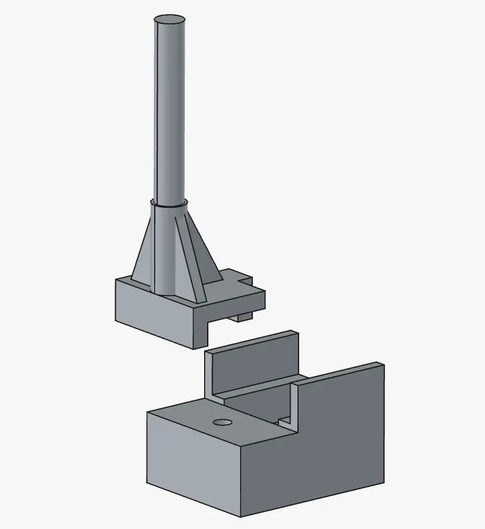

后来一装同步带，惰轮支架直接被拉掉下来了，所以重新设计，做了三层的惰轮支架，每层用螺丝固定。

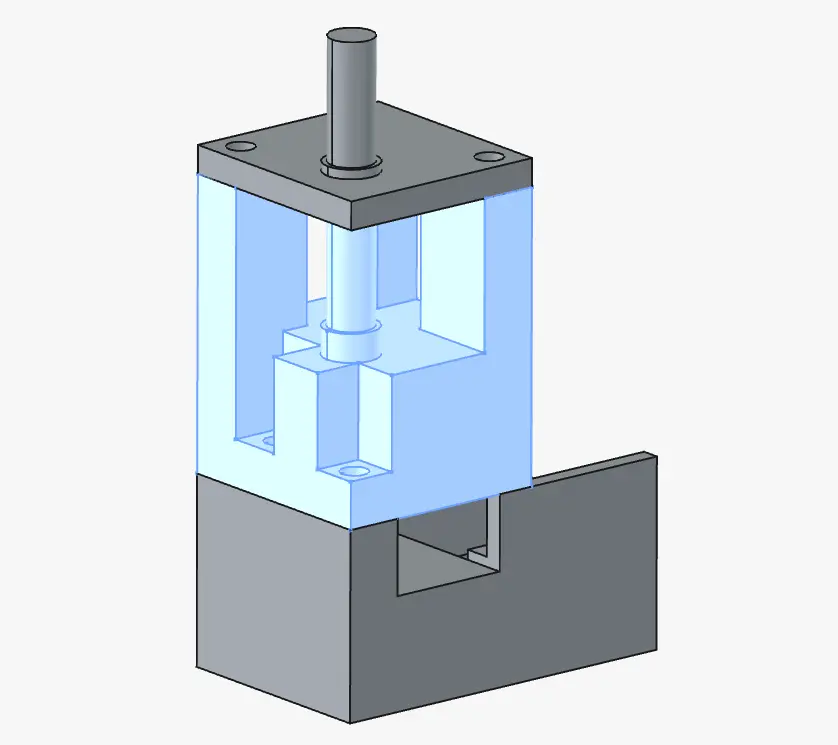

同步带是往里拉的，所以上面那两层只在外侧用两个螺丝固定。两侧的支架不一样，在切片软件里镜像就行了，CAD 里就做了一个。

接下来是步进电机的支架。我买了两个 NEMA17 电机，高度 4cm ，有一个电机必须倒过来放，不然同步轮不够低，会爬坡，所以两个支架不能简单的镜像。

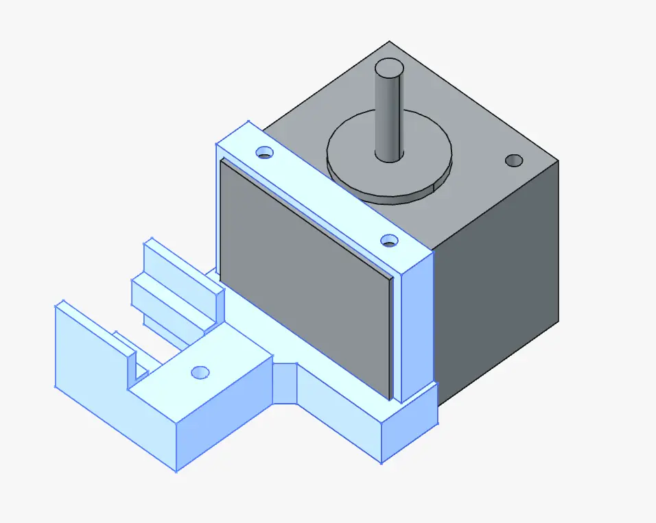

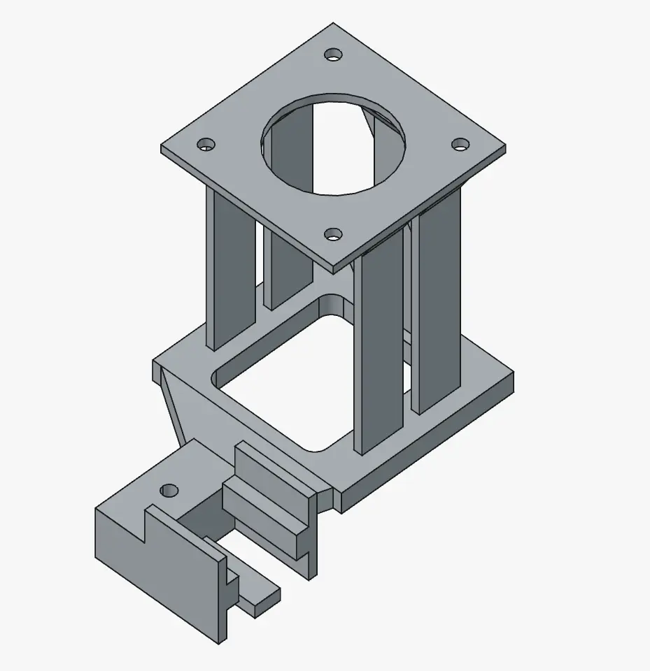

这个结构不是很结实。后来绕上了同步带，电机会轻微往前翘，只能拿一个重一点的东西压住。我也是没想到同步带有那么大力。

最后是 Y 轴两个滑块。它的作用是固定惰轮和 X 轴导轨。和第一次做的惰轮支架一样，用两根圆形的杆固定惰轮，不过因为这是一体的，所以强度还不错，装上同步带后也没有什么变形。

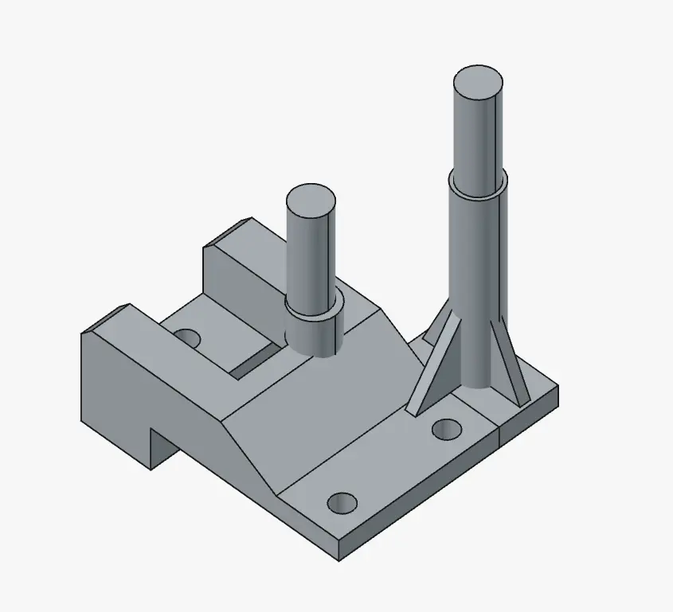

## “工具头”

首先固定同步带。同步带卡扣是买的，在工具头上打两个孔，然后把用螺丝把卡扣固定住就行，这个简单。

难的，是怎么落笔。

最简单的方式就是把笔直接固定在舵机上，稍微偏离中心一点点，通过舵机转动直接带动落笔/抬笔。

不过，它有一些缺点。
第一，工具头离纸有 4cm 左右，笔固定不稳，和纸的摩擦力大时容易卡住；
第二，笔不是垂直落下去的，有可能写不出字。用过圆珠笔的都知道，斜着握笔，需要往手的方向“拉”，“推”是推不动的。而且落笔的角度和位置还会随着纸的高度而变化，如果在一本厚一点的书上写字，倾斜的更厉害，落笔位置也不可预测。
圆珠笔还是比那种大头的马克笔难驾驭一些。

还有一个方案，同样是用舵机，但它在笔尖处固定，然后舵机通过抬起/放下笔芯尾部实现控制。不过，它仍然有以上问题。

所以我就用了齿轮条方案：在舵机上装齿轮，在齿轮条上装笔，在工具头上放一个垂直的滑槽，舵机带动笔垂直运动。

打开 FreeCAD 的 Addon manager ，安装 freecad.gears ，它需要 scipy 依赖，用 apt 安装：

```shell
sudo apt install python3-scipy
```

切换到齿轮工作台，创建 InvoluteGear 和 InvoluteRack ，调整尺寸，然后用 Part Design 画一个管道，拿来插笔芯。

我选择的是按动笔的笔芯，而不是拔盖签字笔的笔芯，因为按动笔的笔芯粗一些，结实，也短一些。

我手上没有直径稍大的弹簧，只能用按动笔自带的弹簧，只能把弹簧安装在它原本的位置。

第一次做出来就是这样的：

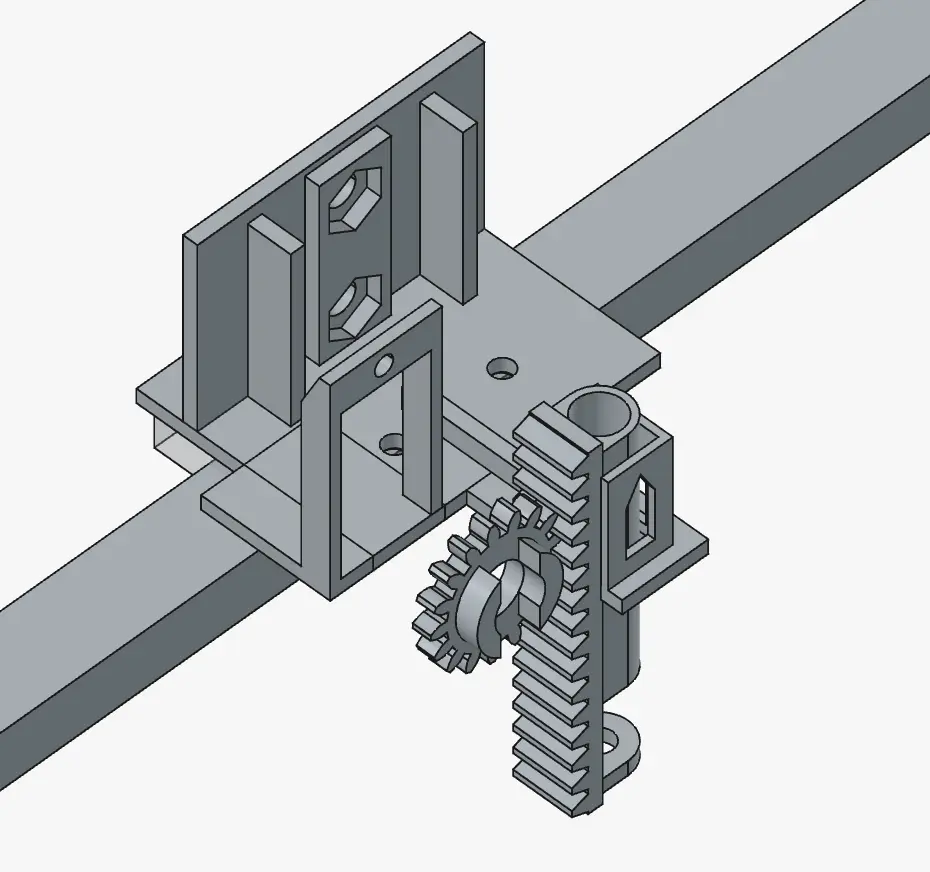

组装好机器。

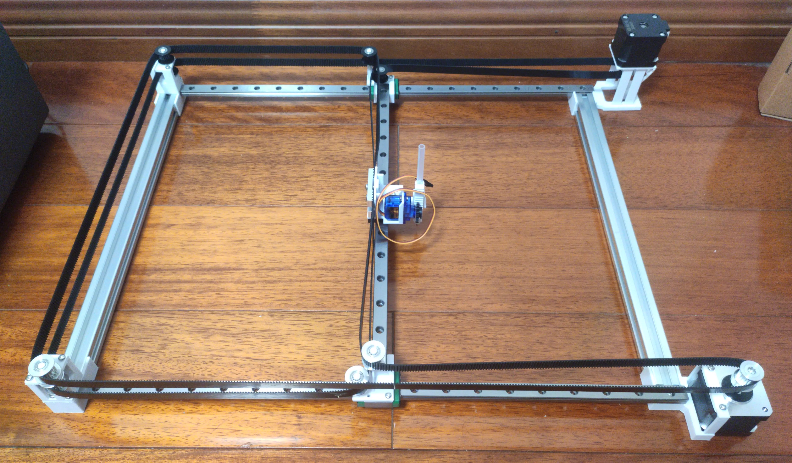

## 控制

### 步进电机驱动

驱动板的芯片是 ATD5833 。

首先，照着步进电机和驱动板的引脚定义接线：

|驱动板|接线|
|:---:|:--:|
|VM|12V 电源|
|GND|接地|
|EN|接地使能|
|MS1、MS2|不需要微步，接地|
|M1A|电机 A+|
|M1B|电机 A-|
|M2A|电机 B+|
|M2B|电机 B-|
|VCC|3.3V 电源|

上电，电机没有通电。我用手去转电机的轴，跟没通电时的感觉一样，正常情况下应该是有一个保持力矩的。

排查各个引脚的问题：

- VM 连接了 12V 电源，没问题。
- EN 接地是使能，我接地了。即使悬空，也有半流锁定功能，应该也有保持力矩的。
- VCC 连接了 3.3V 。驱动板也支持 5V ，我也试了 5V ，没用。

拿万用表测驱动板的输出电压，在 0.1V 左右跳动，至少有输出，和不通电时还是不同。

我也转过驱动板上的电位器，转到哪都一样。

最后认为是驱动模块坏了，就买了两个 Drv8825 驱动模块。拿到快递后，看到 IC 表面跟抛光了一样，有可能是奸商把别的芯片打上了 TI 的丝印。

模块不需要 3.3V/5V 的 VCC 供电，可能是 IC 内部从电机的电源降压的。然后也用不了，用万用表测，也是电压跳动，拿 Hz 挡位测，有 20kHz 左右的脉冲。难不成是电机的问题？拿万用表测电机的两个线圈的电阻，都有 2Ω 左右，应该没问题。

那再买一个，如果还是不行，那就是我的问题了。我花了3倍的价格，去第一次买 ATD5833 的店铺，再买了两个 TMC2209 模块，一个 15 块钱。

买回来，接上，能用。

便宜没好货，但是能差到直接没法用，我也是真没想到。

### 固件

我手上有现成的 esp32s3 开发板。

固件则选择了 [FluidNC](http://wiki.fluidnc.com/)（网页似乎不支持 HTTPS ）

> FluidNC is a CNC firmware optimized for the ESP32 controller. It is the next generation of firmware from the creators of Grbl_ESP32. It includes a web based UI and the flexibility to operate to a wide variety of machine types.

打开 Espressif 的 [esp-dev-kits](https://docs.espressif.com/projects/esp-dev-kits/en/latest/esp32s3/esp32-s3-devkitc-1/user_guide_v1.1.html) 文档，翻到底部，照着它的引脚图，避开 strapping pins ，连接步进电机驱动板。

FluidNC 有 [Web installer](https://installer.fluidnc.com/fluidnc) ，直接调用浏览器的 Web serial API ，连接 esp32 ，烧录程序。

烧录后，可以在 Web installer 里面修改一些配置。比如，它的 Wi-Fi 默认是 AP 模式，想要用它的 WebUI 就得连接到它的 Wi-Fi ，不方便，可以把它修改成 Station 模式，让它连接指定 Wi-Fi 。它支持 fallback ，如果连不上指定 Wi-Fi ，它会切换回 AP 模式。

打开家里路由器的 WebUI ，查看接入设备，有一个 hostname 为 fluidnc 的设备，在浏览器里用 IP 地址访问它的 WebUI 。

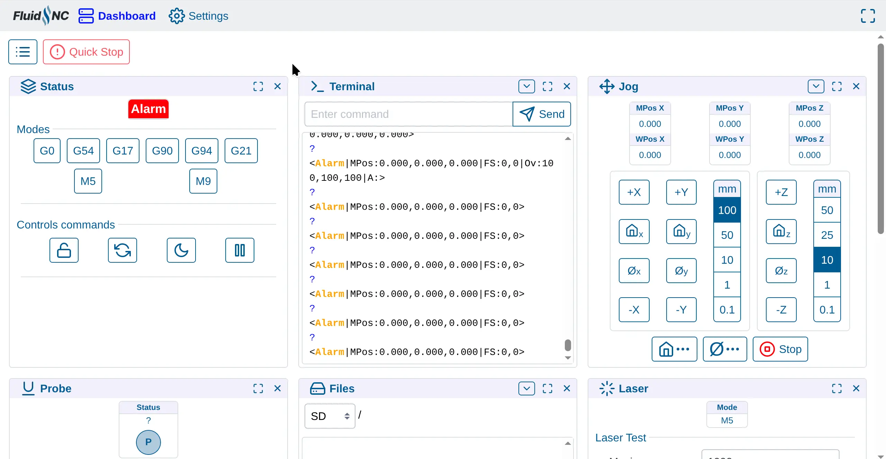

这个 UI 设计的还不错。

写了一个简单的配置文件，把它配置成 CoreXY 模式，再把步进驱动模块连接到的 GPIO 写进去。在 WebUI 的首页上传文件，它默认识别 config.yaml 为配置文件，可以在 WebUI 的设置里修改默认使用的配置文件的文件名。上传完配置文件后重启。

默认在 Alarm 状态，要进入 Idle 状态，需要先 soft reset ，然后 unlock 。它还有 sleep 状态，会关闭所有电机。

在它的 WebUI 里面 Jog XY 轴，Y轴没问题，X轴反了。

配置文件里，给`direction_pin`后面加个`:low`可以反转电机方向，比如`direction_pin: gpio.7:low`。

也就那么6种情况，挨个试试：

- X电机反向
- Y电机反向
- XY电机都反向
- 交换XY电机，X电机反向
- 交换XY电机，Y电机反向
- 交换XY电机，XY电机都反向

我的运气比较差，试到最后一个才成功。

配置成 Z 轴的舵机动不了。关机的时候用手去转舵机，FluidNC启动时会给它设置一个角度，说明还是能控制的。仔细去看 FluidNC 的文档，加上了`steps_per_mm`和`max_travel_mm`这两个配置后，能动了。

FluidNC 就是快，几秒就能重启，改配置很快就能生效，修改部分配置甚至无须重启，我那个 3D 打印机开机都要开半分钟。

完整配置：

```yaml
name: "Plotter"

kinematics:
    corexy:

axes:
  x:
    motor0:
      standard_stepper:
        step_pin: gpio.6
        direction_pin: gpio.7:low
        disable_pin: gpio.47:high
  y:
    motor0:
      standard_stepper:
        step_pin: gpio.4
        direction_pin: gpio.5:low
        disable_pin: gpio.48:high
  z:
    steps_per_mm: 100
    max_travel_mm: 5
    motor0:
      rc_servo:
        output_pin: gpio.21
```

### 写字

接下来我就需要一个 G-code sender ，我选择了 [AxioCNC](https://github.com/rsteckler/axiocnc) ，去它的 Releases 里面下载 .deb ，然后用`sudo dpkg -i axiocnc.deb`安装。

我第一次下载的是 desktop 版，启动后它会打开自带的 Chromium ，但是一直显示连接中。之后又下载了 headless 版，在浏览器里访问它的前端。后来想起来，第一次打不开有可能是因为我在环境变量里配置了代理。

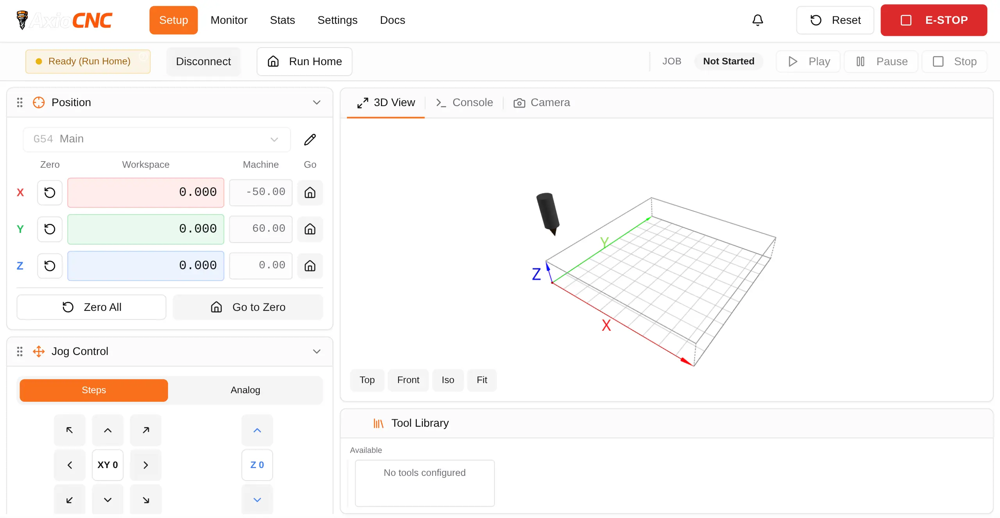

去设置里连接 esp32 ，选择对应的串口。回到主页，连接。

用 Inkscape 写一个 Hello world ，选中它，在工具栏的 Path 菜单里使用 Object to path，把它转为 path 。

找了一个 svg 转 G-code 的工具：[svg2gcode](https://sameer.github.io/svg2gcode/) ，把 svg 放进去，导出 gcode 。

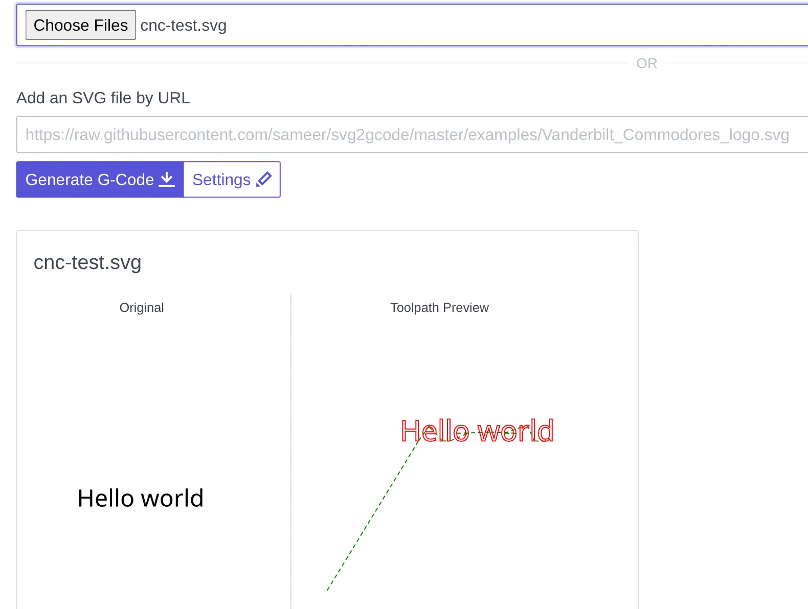

可以用 [NC Viewer](https://ncviewer.com/) 预览。

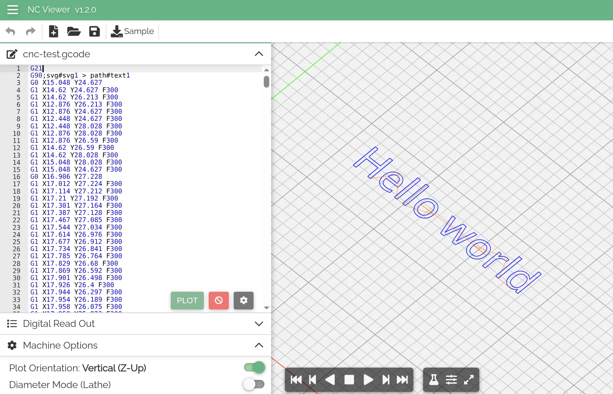

它没有生成抬笔/落笔指令，需要自己加。用 nvim 编辑 gcode，在 G0 前后插入抬笔和落笔命令：

```text
:%s/^G0.*/G0 Z-3\r&\rG0 Z-13/
```

加载 gcode 到 AxioCNC 里，手动归零，启动 job ，最后写出来是这个样：

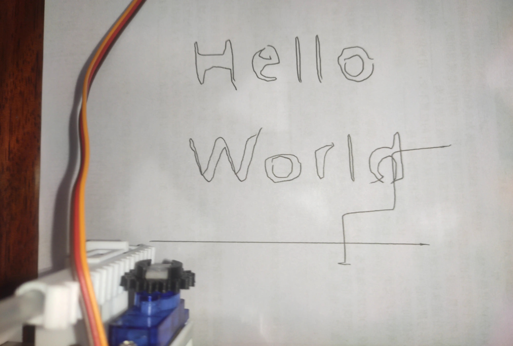

因为纸和笔尖的摩擦力大，再加上固定笔的地方离纸比较远，写字时，笔尖容易“卡”在纸上。跟用手拿笔是一个道理，握笔时离笔尖远了，力气小了，控制力就差，机器也是一样。

所以我改进了工具头，加长了导轨的长度，让它离纸更近一些。也改进了齿轮条，在笔尖的位置固定住，防止笔芯本身变形。

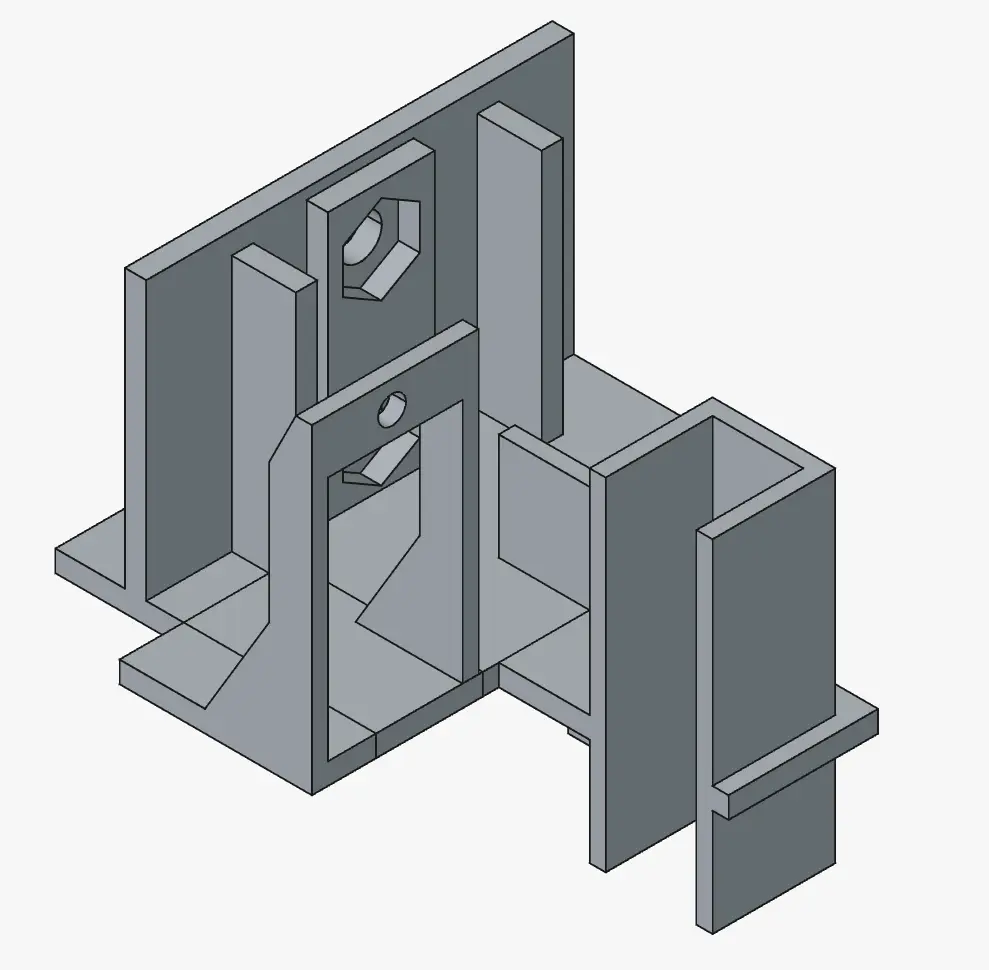

再换上一个几乎是新的笔芯，拿它写字：

```text
2026/7/30
我用 FluidNC + AxioCNC
控制 Plotter
写下这段文字
```

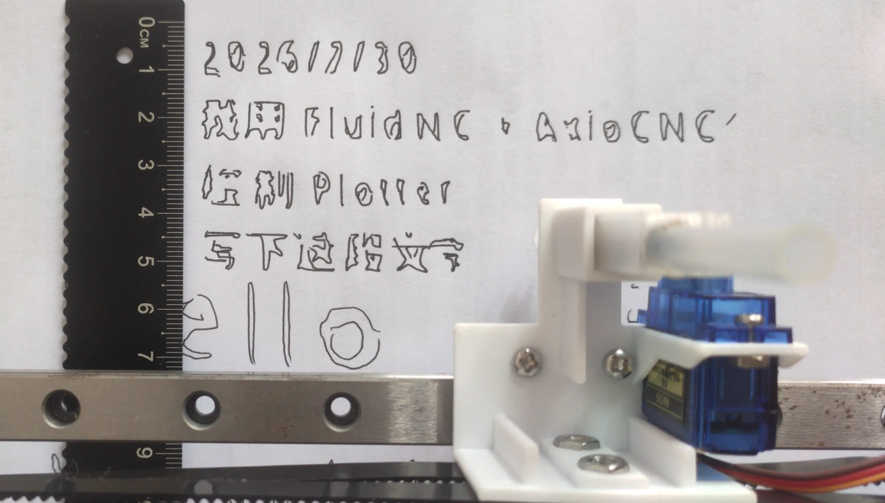

跟旁边的 Hello world 比，确实好了很多，但还是远远达不到我的要求。

通过继续加长 Z 轴导轨，让导轨离纸更近，来提升稳定性，这个方法应该不管用了。第一，毕竟是塑料，导轨长了会变形；第二，导轨长了，3D 打印时就需要更多支撑；第三，齿轮条和导轨之间的摩擦力会变大。最后，导轨如果更低，如果我要在一本厚一点的书上写字，导轨和地板之间就没有足够距离了。

## 重新设计

既要在 XY 平面不晃动，又要在 Z 轴上下运动，我能想到的，只有金属的直线导轨了。我就买了一条 10cm 的 MGN7 导轨和一个 MGN7C 滑块。7mm 宽的导轨非常细，笔芯都有 5.4mm ，但它很轻。

我选择固定滑块，让导轨上下运动，跟之前的做法差不多，只是塑料导轨变成了滑块，而齿轮条变成了导轨。

可以继续用舵机和齿轮条带动导轨上下运动，不过既然改都改了，那就改的彻底一点，把它变成一个真正的 Z 轴。于是，我买了一个 NEMA11 步进电机，长度和宽度都是 28mm 。小电机居然比那两个 NEMA17 的大电机还贵几块。最后加上同步轮、同步带。这次的同步带用 6mm 宽的。

先改工具头，电机没有直接放在工具头上，而是架起来，给固定工具头的螺丝钉留位置，再在右侧加上惰轮支架和滑块支架。

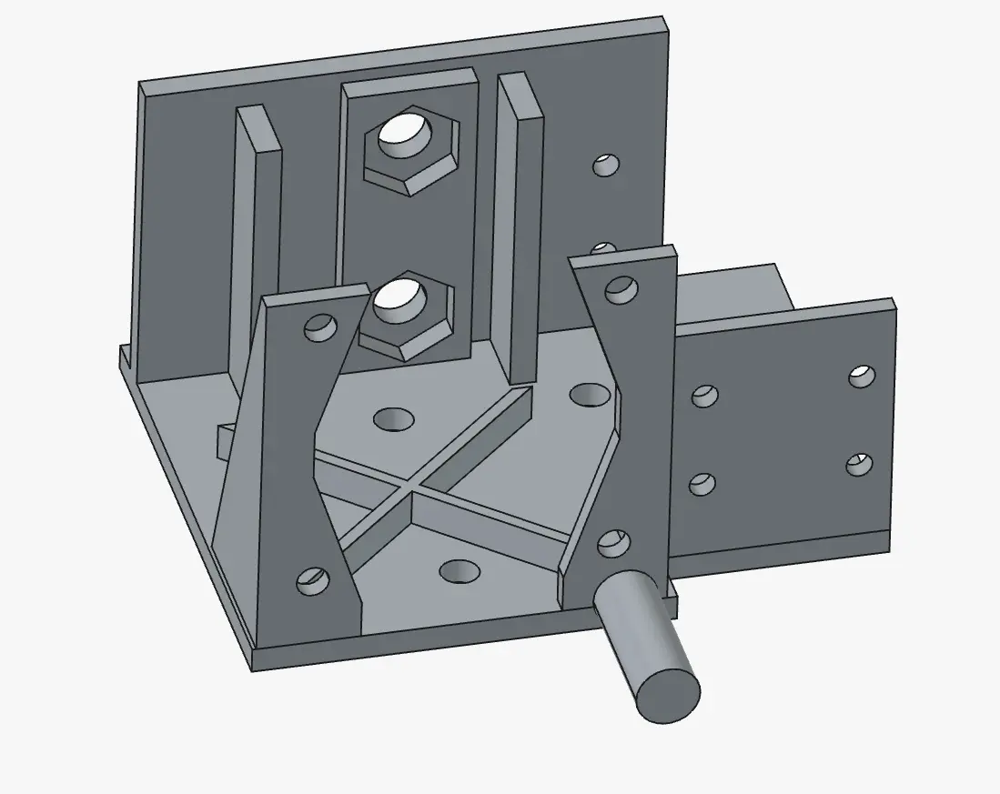

Z 轴同步带的两端固定在导轨上。其实更好的做法是固定在工具头右侧，导轨上用惰轮，类似动滑轮，这样可以减少对导轨侧向的拉力。但是，第一，惰轮很大，第二，工具头本来就很宽了，再加宽就没多少空间运动了。

改完工具头，快递还没到，还有大把时间，于是把别的几处也改了。

Y 轴上的左右两个惰轮支架用柱子支撑，容易变形，改成和前面两个角落一样的三层结构。

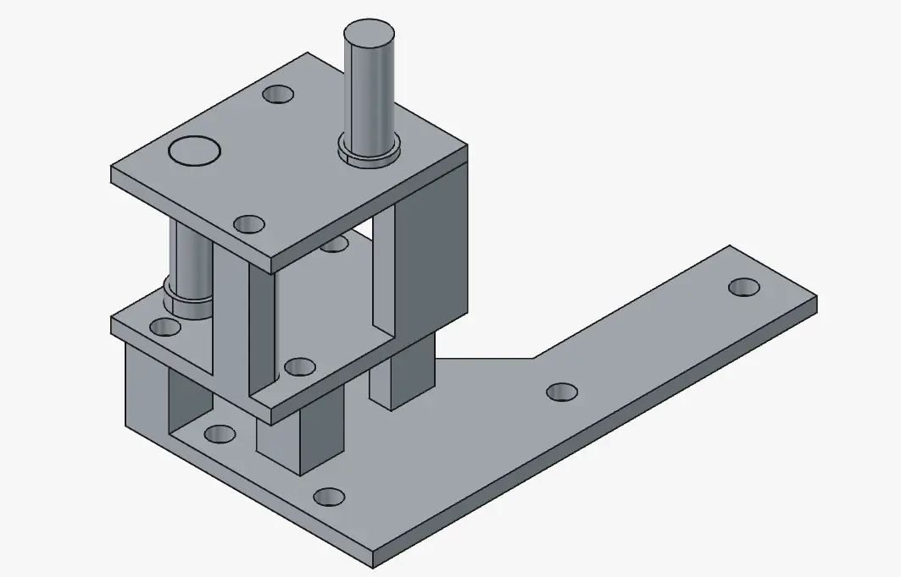

可惜 X 轴导轨买短了，如果长一点，就可以直接用螺丝固定在滑块的钉孔上。金属的，更稳。

电机往前翘。正放的电机支架从两个螺丝固定改成四个。倒放的电机支架的高度减少几毫米。再加上框架容易变成平行四边形，于是给每个导轨的两端都改成用两个螺丝固定。

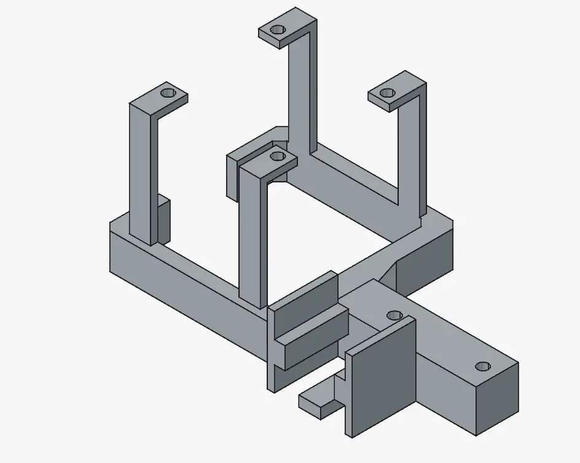

改完之后，闲着没事干，给电机、导轨、铝型材、同步轮和惰轮建模，切换到 Assembly 工作台，把它们和我自己的零件一起放到一个 Assembly 里面，添加 Fixed joint 和 Revolute joint ，工具头就可以在导轨上滑动：

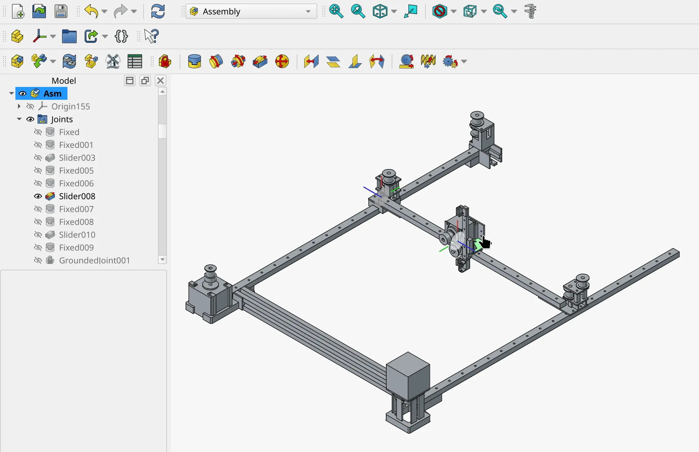

当然，这么做也有点用，我可以在 Assembly 里用 Measure 工具测量同步轮、惰轮和工具头上的同步带卡扣是否在一个高度上，防止同步带爬坡。

到货了之后，量了尺寸，没问题，开始打印所有零件，同时拆掉之前装的机器。

除了设计改进，这次我也用了 ABS 代替之前的 PETG ，应该更硬一些。

组装好：

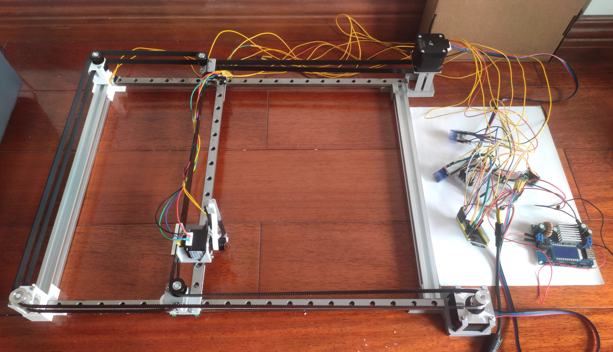

虽然比 V1 稳了很多，但两条同步带仍然要一样紧，不然 X 导轨会歪一点。

本来有两个 5V 稳压模块的，都拿去[改车](../rc-rack)了，附近又没地方插充电头，只能用可调电源，把 12V 降到 5V ，给开发板供电。

工具头特写：

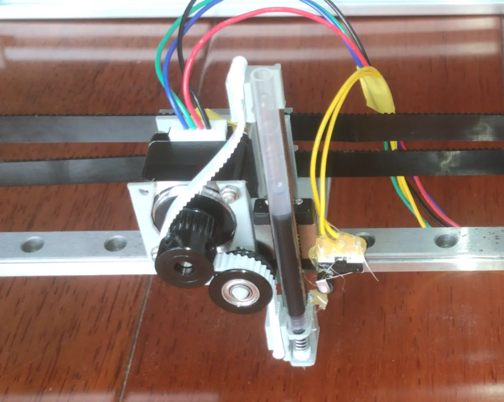

用两个惰轮会更好，但是没地方装了。

线有点乱，但不影响使用。

## 修改配置

电机的步距角是 1.8° ，GT2 同步带的齿距是 2mm ，我用的同步轮有 20 齿，`steps_per_mm`就应该是`(360°/1.8°)/(20*2)=5`，但实际它走的距离远小于预期，我就看了步进驱动器的文档，它的 MS1 和 MS2 引脚控制了微步，最大是 1/8 ，没有全步，我不知道默认情况下它是拉低还是拉高，就把两个引脚接地，就是 1/8 微步。设置的`steps_per_mm`就要乘4，也就是 40 。

然后启用 homing ，XY 轴的原点就是左前方，Z 轴的原点是它能运动到的最上方。

测试的时候，Z 轴导轨撞到了铝型材，还好影响不大，笔还是挺紧的。~~这下真的需要一个物理的 E-STOP 急停按钮了。~~ 加一个软限位，设置`max_travel_mm`和`soft_limits`。

```yaml
axes:
  x:
    homing:
      positive_direction: false # 向负方向寻找限位开关
      mpos_mm: 0 # pull off 结束后的 X 轴坐标
      cycle: 2 # 一键 home 时，先移动 Z 轴，再移动 XY 轴
      seek_mm_per_min: 1000 # homing 时的速度
      soft_limits: true # 如果 gcode 移动距离的超过软限位，打断。jogging 默认有软限位。
    motor0:
      limit_neg_pin: gpio.12:low:pu # 常开限位开关的 GPIO ，默认 pull up
      pulloff_mm: 5 # 碰到限位开关后，向正方向移动一点距离，离开开关
      # ...
  z:
    homing:
      positive_direction: true # 向正方向（上）寻找限位开关
      cycle: 1 # 第一轮 homing
    # ...
```

FluidNC 的默认速度很慢，需要自己去试，找到合适的速度。Z 轴的运动距离就那么一两毫米，速度不重要，所以主要是 XY 轴的。

默认的 jogging 速度很慢，需要用 gcode ，自己设置 feed rate ，比如`G1 X200 Y300 F1000`。

一开始我设置的`max_rate_mm_per_min`是 6000 ，也就是 10cm/s ，之后每次提升 2000 ，提升到 14000 的时候出现异响，但距离仍然精准，我觉得可能是共振问题，就继续提到 16000 ，开始丢步，于是最终把速度设在 12000 。`acceleration_mm_per_sec2`一开始设在 300 ，后来提升到 500 ，够快了，就没再往上试。

写个字试试：

```text
2026/8/3
Plotter V2
重新设计，精度大幅提高
```

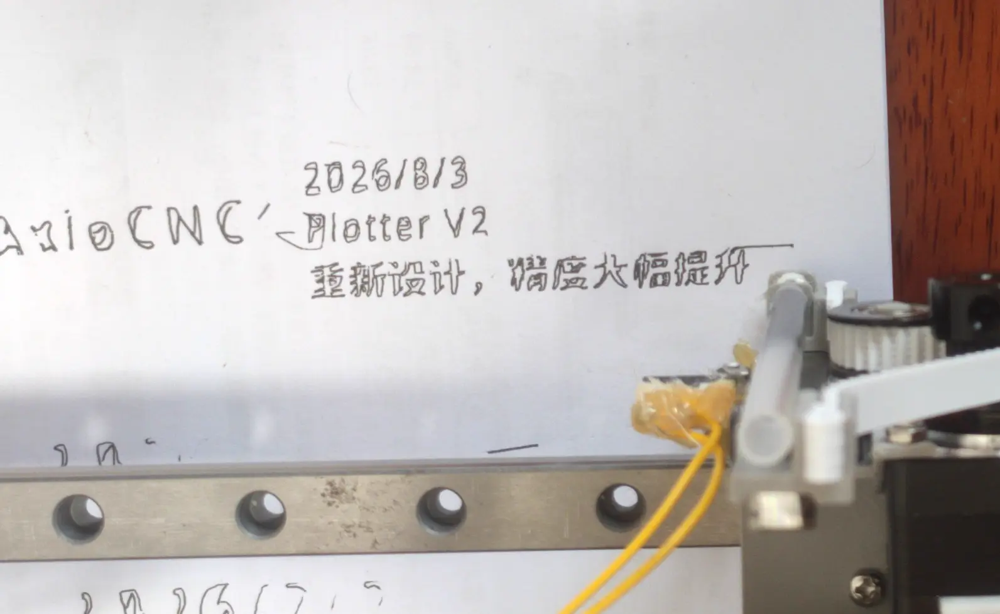

相比左边写的"AxioCNC"，效果好了很多。

后来测试时，12000 的速度也时不时丢步，所以改回了 8000 。

---

除了研究 CoreXY 结构，还有一个原因让我做了这个写字机。

2024 年 9 月，极客湾发布了一个视频：[我们造出了“自动写作业机器人”](https://www.youtube.com/watch?v=jWgvvESR09k)，从框题到推理、写字，甚至翻页，都能全自动完成，我十分羡慕。当时我刚上高中，技术这一块，可以说是几乎不懂，尤其是硬件。但我一直都有要做它的想法。

现在做出来了，它到底能不能写作业呢？

我半个月前做了[作业管线](../homework-pipeline)，用 AI 解决了 OCR 和推理，但仍需手写。截至这个项目完成，我已经用手写完了大部分的暑假作业，但还留了几页，给它来写。作业管线数据还留着，从数据库里拿出来 AI 生成的答案。

我选择了让它写数学的大题，因为空间够大，写歪一点也没事。缺点就是，需要解决 LaTeX 的问题。

Markdown 是这样的：

```markdown
(1)

$x_n = 2(n-1) = 2n - 2$

$y_n = 2 \cdot 3^{n-1}$

$\begin{cases} a_n - b_n = 2n - 2 \\ a_n + b_n = 2 \cdot 3^{n-1} \end{cases}$
```

安装 Pandoc ，把它渲染成 PDF ：

```shell
sudo apt install pandoc texlive-latex-recommended
pandoc answer.md -o answer.pdf
```

不支持全角标点符号，手动删去。

把生成的 PDF 导入到 Inkscape ：

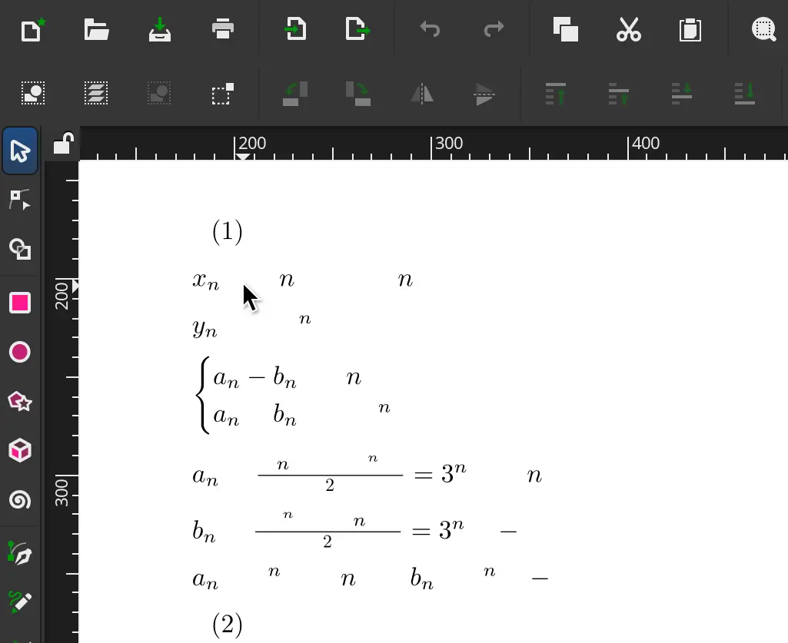

大概是字体问题。在导入时选择 Draw all text ，把所有字转为 path ，这下可以了。

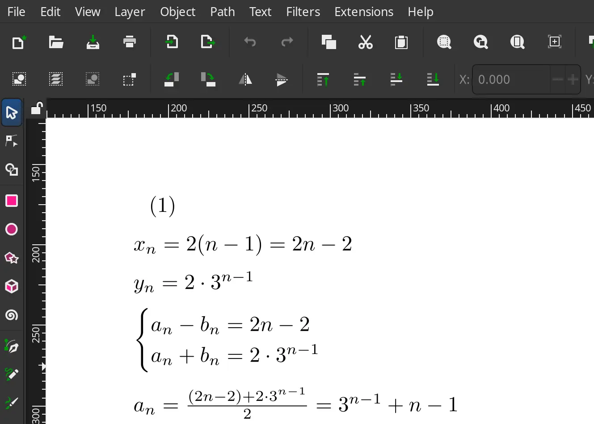

保存为 svg ，用 svg2gcode 转换：

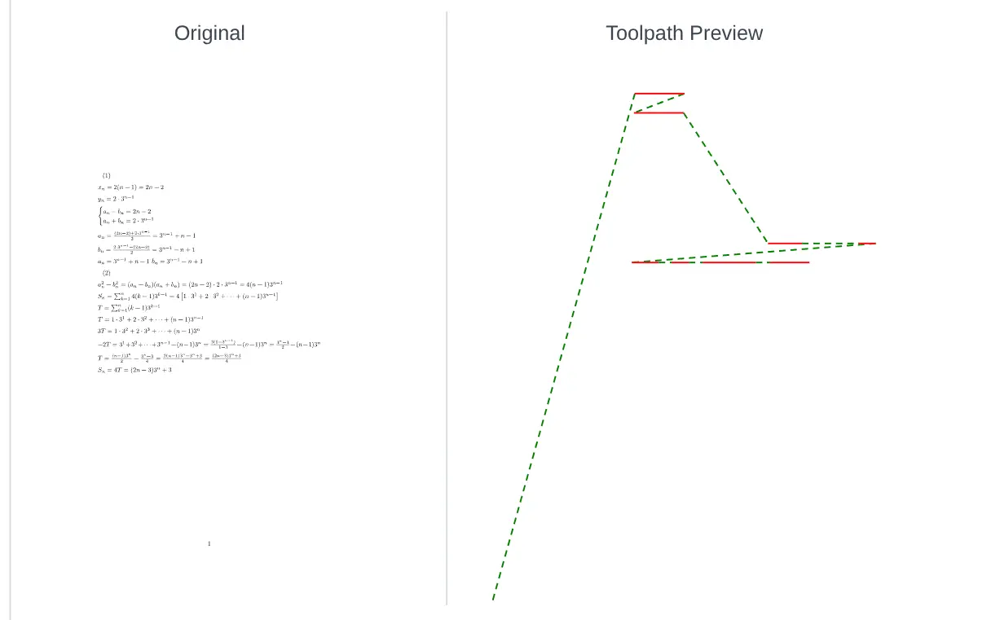

不知怎的，就是生成不了，我用 Inkscape 导出 Plain svg 也不行。找个 svg 清理工具：[svgcleaner](https://github.com/RazrFalcon/svgcleaner) ，用 Rust 写的，最后一次 release 是 8 年前，有 Linux 版

```shell
./svgcleaner math.svg math-clean.svg
```

8 年前的，还能用，静态链接的优点就是这个了吧。

再放到 svg2gcode ，这下能正常生成 gcode 了。

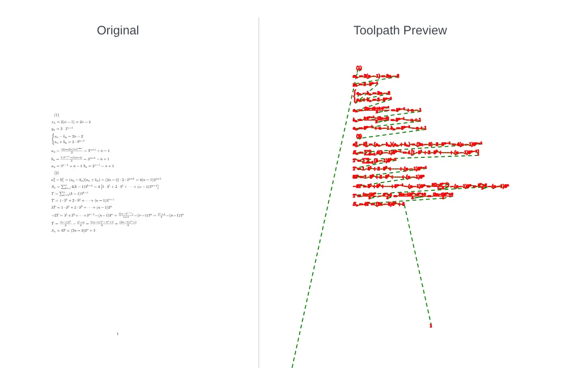

用 NCViewer 预览，才发现忘用单线字体了，它仍然是描边。

Inkscape 里有一个功能：Extensions > Text > Hershey text ，可以使用 [Hershey font](https://en.wikipedia.org/wiki/Hershey_fonts) ，把文字转为单线字体。

重新导入 pdf ，选择 Keep missing font's names ，打开那个拓展，开启 Live preview 。

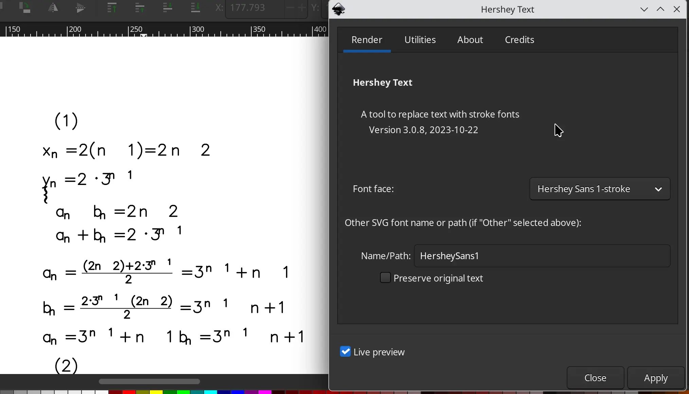

可以看到，所有的减号都渲染不出来。试了它自带的所有字体，都没用。

把减号复制出来，在 [Unicode explorer](https://unicode-explorer.com) 里面搜索。它的减号是 U+2212 minus sign ，而不是键盘上的 U+002D hyphen minus 。

手动替换 minus sign 为 hyphen minus 。大括号的问题是没法解决了，除非自己画一个。

在 Inkscape 里面调整文字大小和位置，再生成一个 gcode ，用 nvim 加抬笔落笔。导入 AxioCNC ，开始。

<video src="./homework.webm" controls></video>

实际花了 13 分钟，远慢于手写。视频用了 30 倍的速度。

虽然不如极客湾的那个，我做不出自动识别，也做不出自动翻页，但它至少能用。

## 总结

FreeCAD 文件和完整的 FluidNC 配置我都放在 GitHub 的 [BinTianqi/Plotter](https://github.com/BinTianqi/Plotter) 仓库里了。

最后，拿它画一个 [ATRI](https://zh.wikipedia.org/wiki/ATRI_-My_Dear_Moments-) 的学校吧。

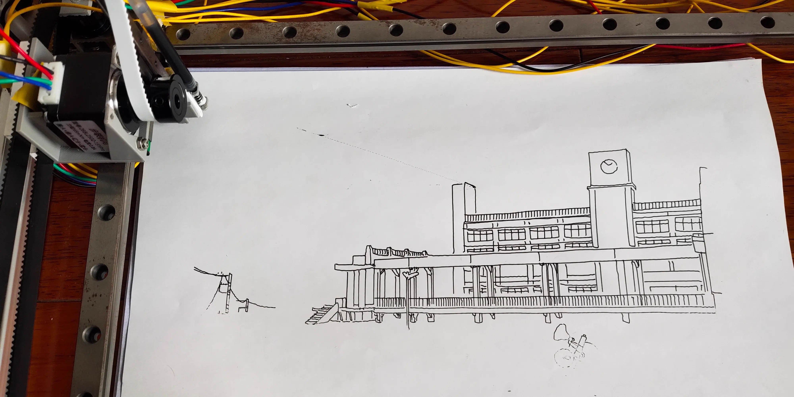

（自己在 Inkscape 里描的线，svg 也放在 GitHub 上了）

## 材料清单

### 硬件

#### 主框架

- 3 * MGN12 导轨（两条 50cm 的，一条 35cm 的）
- 3 * MGN12C 滑块
- 2 * 2020 铝型材（两条 35cm 的）
- 1 * GT2 同步带（一卷 5m）
- 2 * GT2 同步轮
- 6 * GT2 惰轮（10mm 宽，带齿）
- 2 * GT2 惰轮（10mm 宽，不带齿）
- 2 * GT2 同步带卡扣
- 2 * NEMA17 步进电机

#### Z 轴

- 1 * MGN7 导轨（10cm）
- 1 * MGN7C 滑块
- 1 * GT2 同步带（6mm 宽）
- 1 * GT2 同步轮（6mm 宽）
- 1 * GT2 惰轮（6mm 宽，不带齿）
- 1 * NEMA11 步进电机

#### 其他

- 1 * 12V 电源
- 3 * TMC2209 步进电机驱动模块
- 1 * esp32s3 开发板

总成本不到 300 块。

### 软件

- FluidNC
- AxioCNC
- Inkscape
- svg2gcode
- NCViewer

