升高三，班里统一买置物架。当时我就想把它改成遥控车，我觉得三层的重心不稳，所以我极力反对买三层的，但是一些同学嫌两层不够用，最后少数服从多数，还是买了三层的。就是这样：

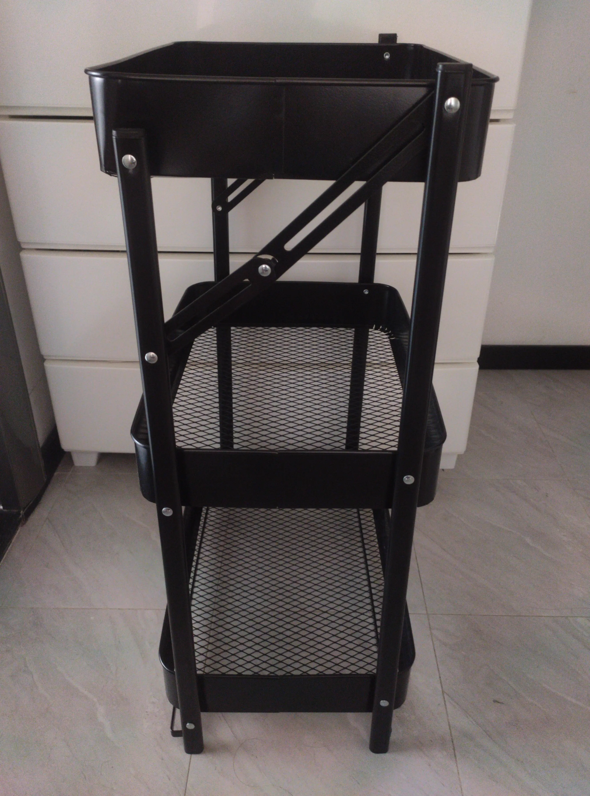

（本来是有小轮子的，已经被我拆掉了）

放假时我把它拿回家。7/18 ，开始改造。

## 硬件

### 轮毂

看了一圈，没找到 6mm 轴径而且是D轴的轮子，所以随便买了4个直径 5cm 的轮子，然后自己 3D 打印轮毂。

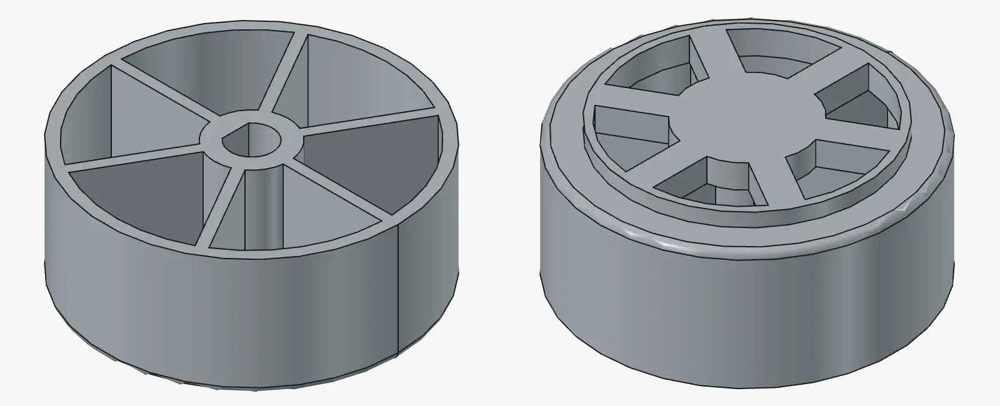

用的 ABS 材料，打印完了，等热床冷却到室温，粘在热床上，用了好大力才掰下来，那层很薄的支撑还粘在上面，只能拿刀刮，很难刮干净。再刮就把 PEI 涂层刮烂了。摸起来还算平整，将就着用吧。

再看轮子本身。那个D轴的孔留得有点小，电机的轴插不进去。而且支撑树和模型本身粘的太牢了。

调整设计，把D轴那个孔的半径改大一点。在 Anycubic Slicer Next 里改参数：

```text
（开启 Advanced ）

Support
    > Support
        > First layer expansion 默认5，改成 0
    > Advanced
        > Top Z distance 默认 0.12 ，改成 0.2
        > Top interface spacing 默认 0.5 ，改成 0.8
```

前后对比：

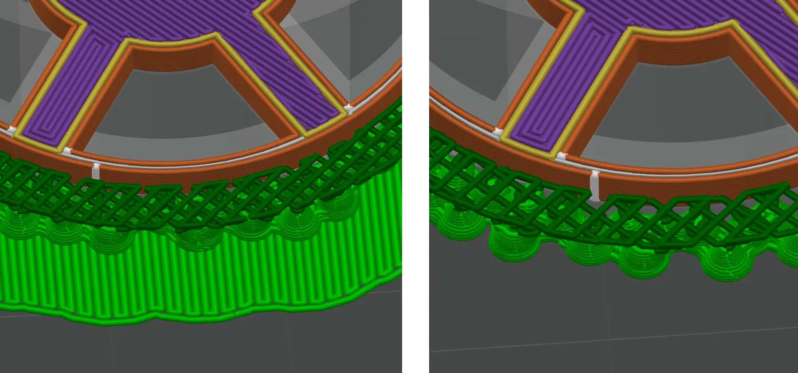

再打印，打印第一层时我去观察，虽然没有那么大的支撑了，但挤出的就像是稀的一样，“渗进”了纹理 PEI 板里，我停止了打印，又花了好久把已经打出来的那几层刮掉，还是没刮干净。PEI 板就是这样的：

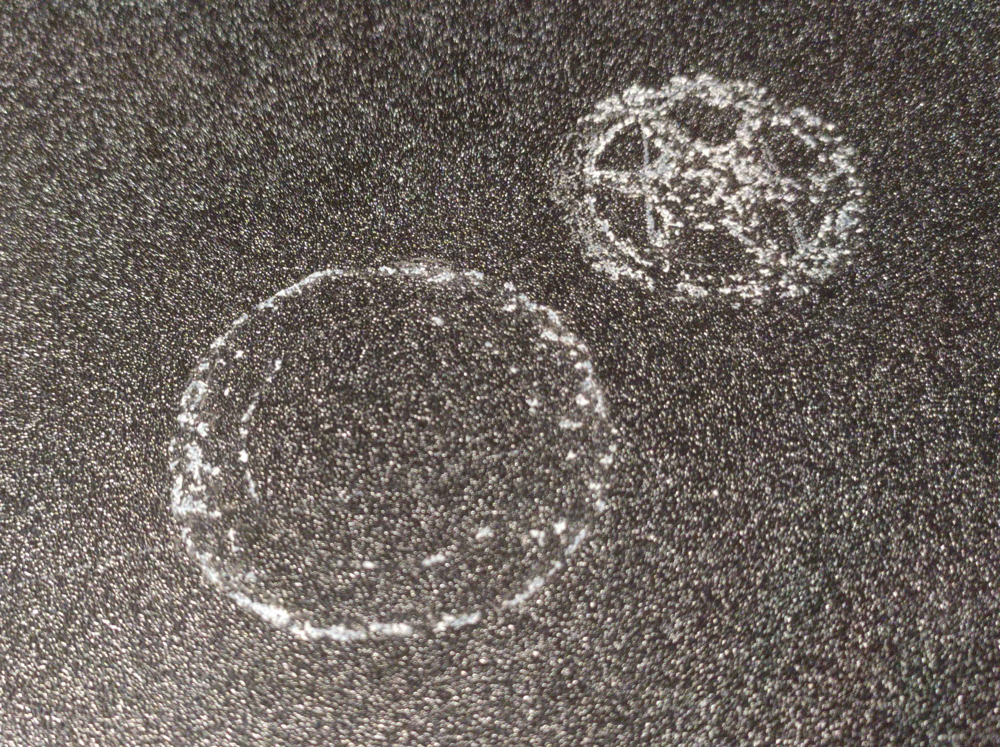

后来我打了两个别的东西，都用 ABS 。在切片时把打印机参数里的 Z offset 从 0 调整为 0.05mm ，打印出来一点都不粘，热床冷到 50°C 左右就自然脱落，根本不用掰，比 PETG 和 PLA 还好拿，而且也没有翘边的问题。

我就一直用这个方法，直到我打了一个比较大的东西，发现有的地方粘，有的地方不粘，才想起来，好久没有调平热床了，从此以后我每次打印都会开自动调平，以后就几乎没有遇到过取不下来的情况。

### 后轮 电机支架

轮子的的间距大概有 25cm ，如果用一条轴，第一，那么长的轴不好买，第二，需要传动皮带。所以，我选择在左右两侧各放一个电机。

我买了两个 JGB37-550 ，自带减速箱，880 RPM ，额定功率 70W 。下单之前拿尺子比划，好像不是很大，拿到手之后才觉得大，而且非常重。

置物架原装轮子是插进空心的铁杆里的，我量了尺寸之后，设计了电机支架：

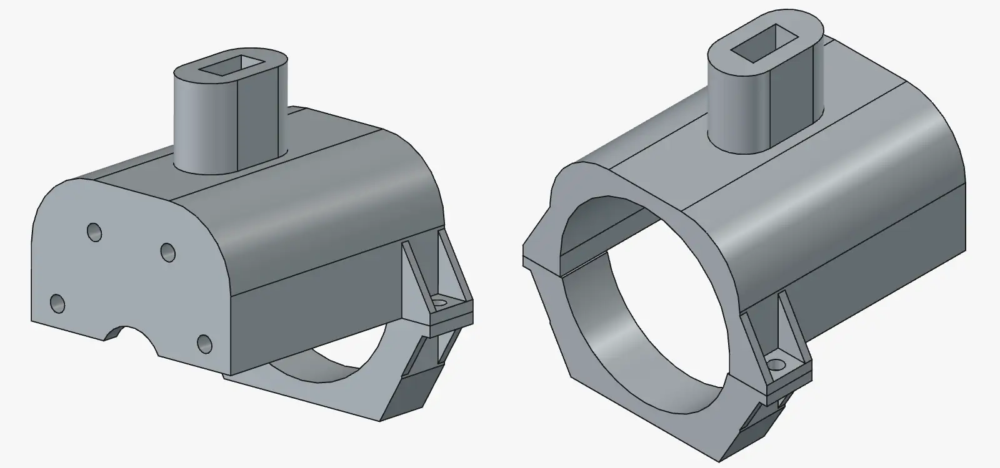

第一次打印，为了省时间，把层高调成了 0.28mm ，快是快，但是打到半圆的顶上时有下垂：

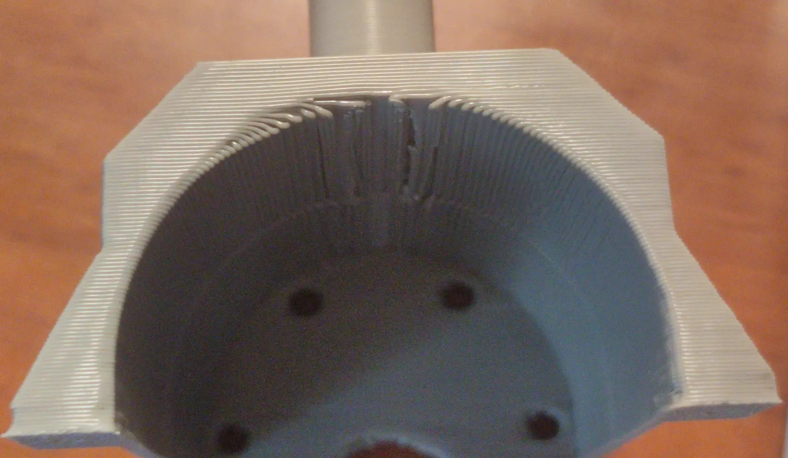

为了取得时间和质量的平衡，我用切片软件的可变层高功能，把顶上那一部分的层高调成 0.08mm ，其余部分的层高大一些。
可变层高不支持有机树支撑，我选了苗条树，打到一半，树倒了，打出来就是这样，我把树的 brim 加宽，还是倒了。

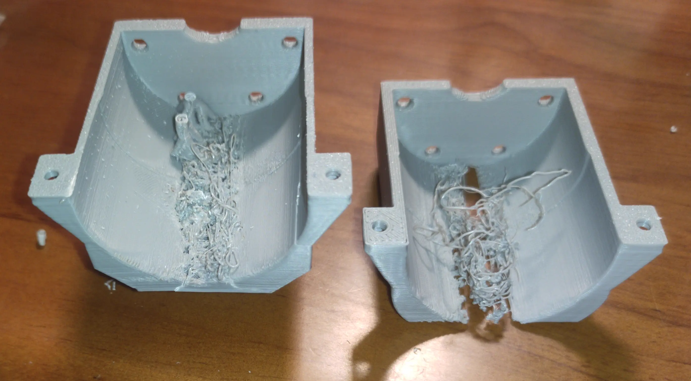

失败了两次，最后老老实实全部用 0.08mm 层高，用有机树支撑，树就没倒。

组装好之后是这样：

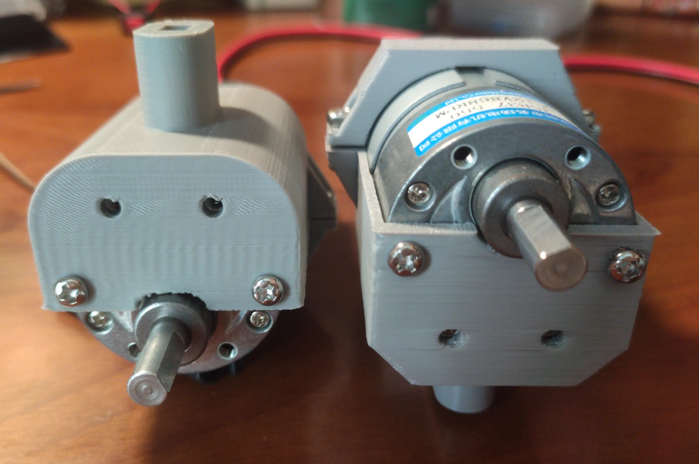

### 前轮 转向结构

虽然我的打印机能打一整条转向连杆，但是打印出来肯定强度不够，所以两侧各一个舵机。9g 舵机应该是不够用的，用了稍大一点的 MG996 舵机。

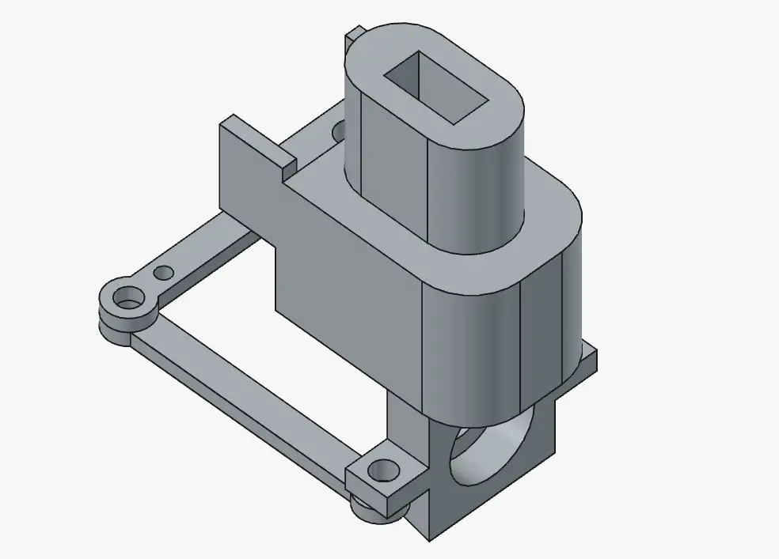

前轮和后轮的轮毂大同小异，凸出来一截轴就行了。

3D 打印有误差，即使我留了空隙，打印出来的孔还是装不进轴承。直接用榔头把轴承砸进去。

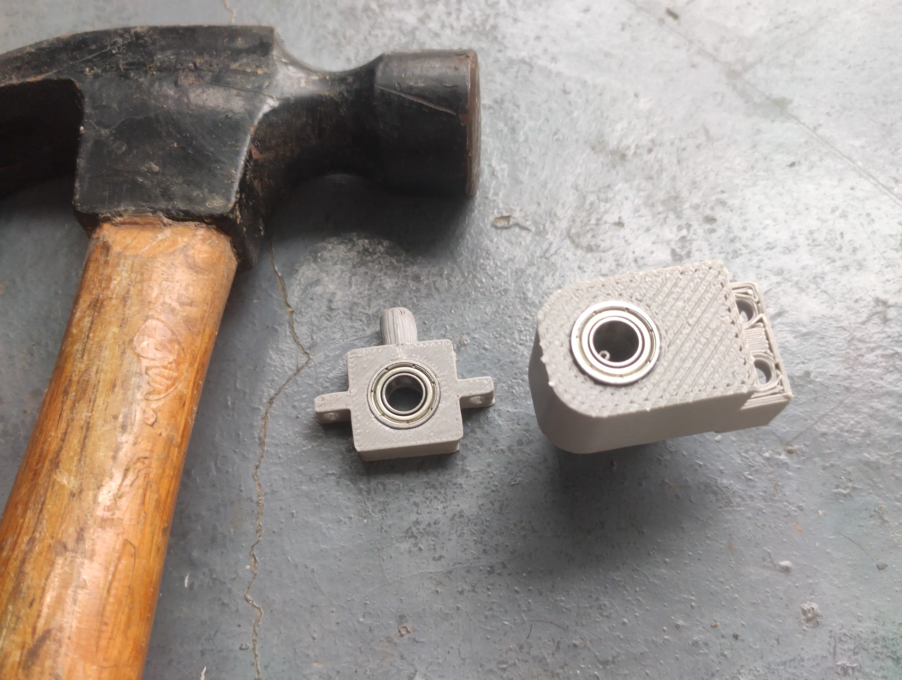

装上轮子和舵机：

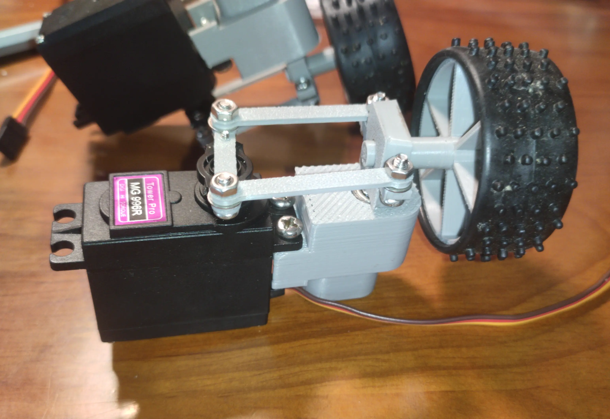

### 电路

用5节 18650 锂电池。不用4节，因为如果每节 3.7V ，4节就是 14.1V ，再加上用电时的压降，可能会导致 12V 降压模块输出 12V 以下的电压。

我想买5节电池串联的电池盒，但是买不到，只能买4串的电池盒，再加一个单节的。

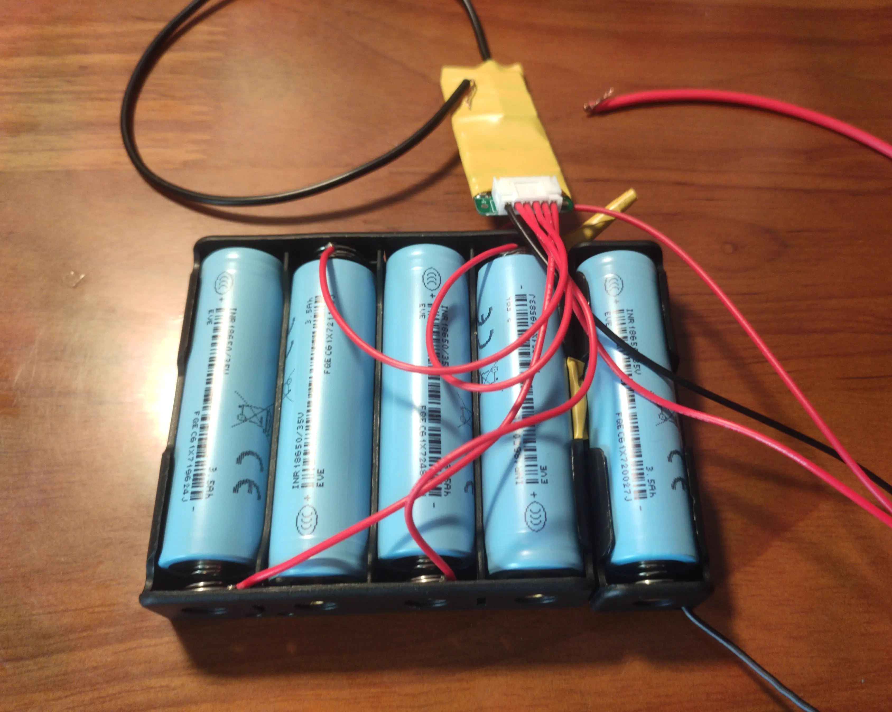

不把电池焊起来，第一，我只有烙铁，没有点焊机，第二，这个车我玩几天就不用了，电池以后还要拿到别的地方用。

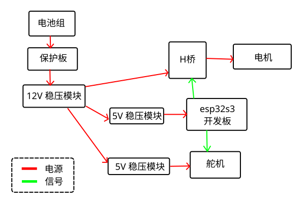

把线接好，放到一个合适的快递盒里，下层是电池和保护板，中间用泡沫隔开，别的都放上层。

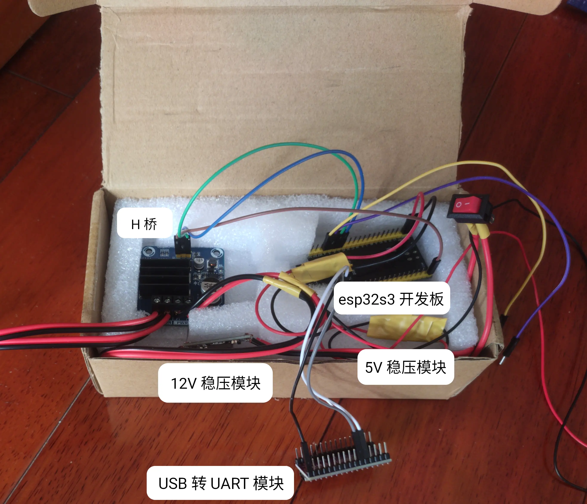

### 遥控器

设计了一个外壳，把 esp32 开发板和两个摇杆电位器装进去。我有 esp32c3 SuperMini 开发板，比 esp32 开发板小很多，但它是陶瓷天线，信号传输距离不如 PCB 天线的 esp32 开发板，所以没用它。

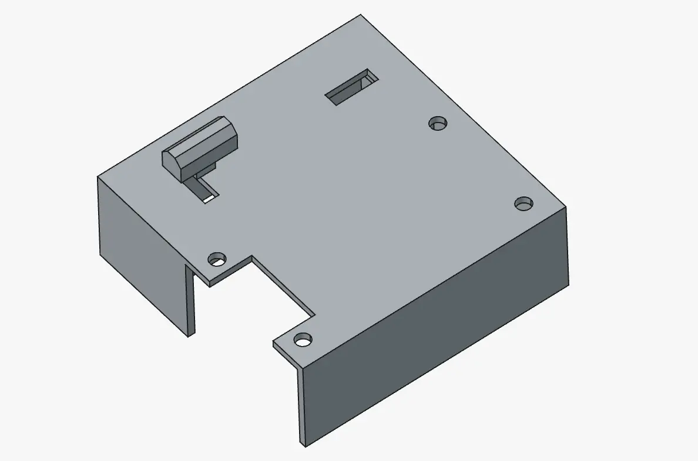

摇杆有3个引脚，左右的接 3V3 和 GND ，中间的接 GPIO 。

翻出一个快4年没用的电池，初一时玩航模用的，竟然还能用，拿来做遥控器的电池了。懒得做开关，不用的时候拔掉电池就行。

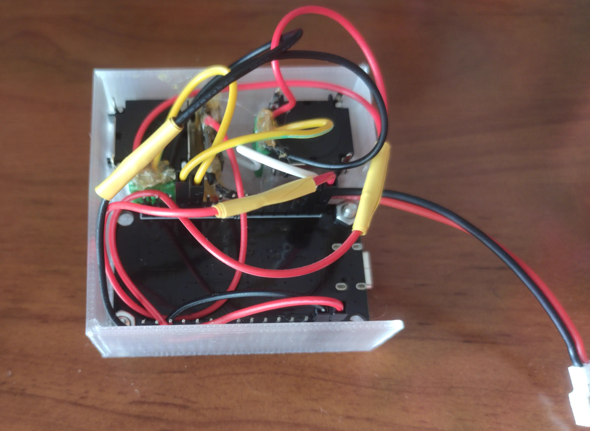

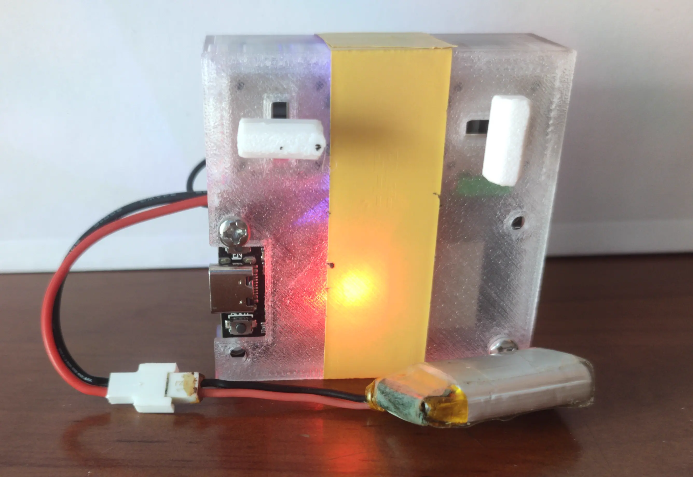

后盖就没做了，直接拿电工胶缠住。

### 材料清单

#### 车

- 2 * JGB37-550 电机
- 4 * 5cm 直径的轮子
- 2 * MG996 舵机
- 4 * 轴承
- 5 * 18650 电池
- 1 * 4串电池盒
- 1 * 单节电池盒
- 控制模块
  - 1 * 5串电池保护板
  - 1 * 12V 稳压模块
  - 2 * 5V 稳压诺快
  - 1 * 单路H桥模块
  - 1 * esp32s3 开发板

#### 遥控器

- 2 * 摇杆电位器
- 1 * esp32 开发板
- 1 * 5V 充放一体模块
- 1 * 锂电池

## 软件

Wi-Fi 和蓝牙的协议栈太复杂，连接速度慢，剩下的选择就只有 ESP-NOW 了。用外接的 sub-GHz 串口透传模块也可以，但是这个车也就室内玩玩，跑不了那么远，没必要。

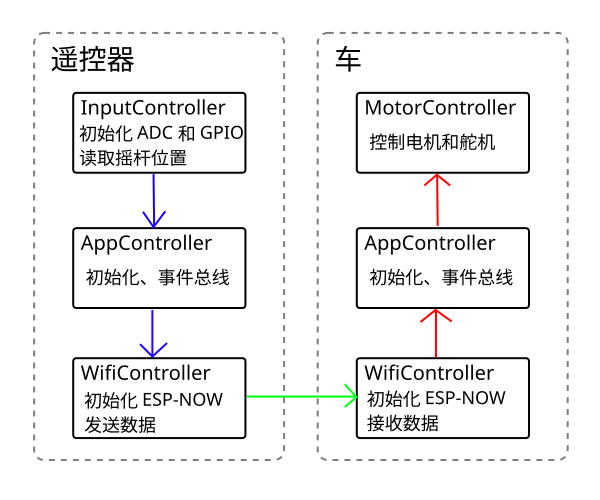

### 车

#### 电机

一开始我用 idf 的 LEDC (LED control) 给 H 桥生成 PWM ，后来我在 idf 的 examples/peripherals/mcpwm/mcpwm_bdc_speed_control ，找到了 Espressif 官方的 [bdc_motor](https://components.espressif.com/component/espressif/bdc_motor) 库，它基于 idf 的 MCPWM (Motor-control PWM) ，把 PWM 操作封装成设置速度、正转、反转、滑行、刹车等函数。

初始化：

```cpp
void MotorController::initMotor() {
    bdc_motor_config_t motorConfig = {
        .pwma_gpio_num = 6,
        .pwmb_gpio_num = 7,
        .pwm_freq_hz = 10000
    };
    bdc_motor_mcpwm_config_t mcpwmConfig = {
        .group_id = 0,
        .resolution_hz = 1000000
    };
    ESP_ERROR_CHECK(bdc_motor_new_mcpwm_device(&motorConfig, &mcpwmConfig, &motor));
    ESP_ERROR_CHECK(bdc_motor_enable(motor));
    setSpeed(0.0f, 1);
}
```

设置速度：

```cpp
void MotorController::setSpeed(float speed, uint8_t mode) {
    // tick period = resolution_hz / pwm_freq_hz = 100
    bdc_motor_set_speed(motor, static_cast<uint32_t>(speed * 100));
    if (mode == 1) {
        bdc_motor_forward(motor);
    } else if (mode == 2) {
        bdc_motor_reverse(motor);
    } else {
        bdc_motor_brake(motor);
    }
}
```

#### 舵机

我一开始也是用 LEDC 控制舵机的，把 H 桥的 LEDC 换成 bdc_motor 后，我就在 Espressif component registry 搜索 servo ，搜到了同样是 Espressif 官方的 [servo](https://components.espressif.com/components/espressif/servo) 库，它把 LEDC 封装成了设置角度。

初始化：

```cpp
void MotorController::initServo() {
    servo_config_t leftConfig = SERVO_CONFIG_DEFAULT(LEDC_LOW_SPEED_MODE, LEDC_TIMER_0, LEDC_CHANNEL_0, GPIO_NUM_4);
    servo_config_t rightConfig = SERVO_CONFIG_DEFAULT(LEDC_LOW_SPEED_MODE, LEDC_TIMER_0, LEDC_CHANNEL_1, GPIO_NUM_5);
    iot_servo_new(&leftConfig, &leftServo);
    iot_servo_new(&rightConfig, &rightServo);
    setAngle(0.0f);
}
```

让 AI 帮我写了一个 [Ackermann steering](https://en.wikipedia.org/wiki/Ackermann_steering_geometry) 算法，转向时内轮角度小，外轮角度大。

```cpp
void MotorController::setAngle(float angle) {
    constexpr auto length = 35.0f;
    constexpr auto width = 25.0f;
    float delta = degToRad(angle * 20);
    float R = length / tan(delta);
    float inner;
    float outer;
    if (delta > 0) {
        inner = atan(length / (R - width / 2));
        outer = atan(length / (R + width / 2));
    } else {
        inner = atan(length / (R + width / 2));
        outer = atan(length / (R - width / 2));
    }
    float innerDeg = radToDeg(inner);
    float outerDeg = radToDeg(outer);
    if (delta > 0) {
        iot_servo_write_angle(leftServo, leftServoBaseAngle + innerDeg);
        iot_servo_write_angle(rightServo, rightServoBaseAngle + outerDeg);
    } else {
        iot_servo_write_angle(leftServo, leftServoBaseAngle + outerDeg);
        iot_servo_write_angle(rightServo, rightServoBaseAngle + innerDeg);
    }
}
```

### 遥控器

初始化 ADC unit 和 ADC channel ：

```cpp
void InputController::initAdc() {
    auto unitConfig = adc_oneshot_unit_init_cfg_t {
        .unit_id = ADC_UNIT_1
    };
    adc_oneshot_new_unit(&unitConfig, &adcHandle);
    
    auto channelConfig = adc_oneshot_chan_cfg_t {
        .atten = ADC_ATTEN_DB_12,
        .bitwidth = ADC_BITWIDTH_DEFAULT
    };
    adc_oneshot_config_channel(adcHandle, ADC_CHANNEL_6, &channelConfig);
    adc_oneshot_config_channel(adcHandle, ADC_CHANNEL_7, &channelConfig);
    
    adc_cali_line_fitting_config_t caliConfig = {
        .unit_id = ADC_UNIT_1,
        .atten = ADC_ATTEN_DB_12,
        .bitwidth = ADC_BITWIDTH_DEFAULT
    };
    adc_cali_create_scheme_line_fitting(&caliConfig, &adcCaliHandle);
}
```

[esp-dev-kits 文档](https://docs.espressif.com/projects/esp-dev-kits/en/latest/esp32/esp32-devkitc/user_guide.html#pin-layout)里有引脚功能图，可以直观地看出 GPIO 对应的 ADC channel 。（[图片链接](https://docs.espressif.com/projects/esp-dev-kits/en/latest/esp32/_images/esp32_devkitC_v4_pinlayout.png)）

读取 ADC 电压：

```cpp
JoystickData InputController::readJoystick() {
    int aRaw, bRaw, aVoltage, bVoltage;
    adc_oneshot_read(adcHandle, ADC_CHANNEL_6, &aRaw);
    adc_cali_raw_to_voltage(adcCaliHandle, aRaw, &aVoltage);
    adc_oneshot_read(adcHandle, ADC_CHANNEL_7, &bRaw);
    adc_cali_raw_to_voltage(adcCaliHandle, bRaw, &bVoltage);
    // ...
}
```

很多 RC 车的遥控器的左摇杆是上推前进，下拉倒车，这样就没有刹车，我就改成上推前进或倒车，通过按键切换模式，下拉始终是刹车。

不想自己装按键，主要是小按键太难焊线了。偷个懒，按键用 GPIO 0 ，也就是开发板上的 BOOT 键。

### 测试

先给车上的 esp32s3 开发板烧录程序，烧录时会输出 MAC 地址，把它填到遥控器的代码里。

ESP-NOW 就是好用，第一次运行就连接成功了。

慢慢推左边的摇杆，电机加速，没问题。慢慢推右边的摇杆，舵机也转了，没问题。猛地一推右边的摇杆，车上的 esp32s3 开发板红灯一闪，然后没反应了。去看`idf.py monitor`的输出：

```text
ESP-ROM:esp32s3-20210327
Build:Mar 27 2021
rst:0xf (BROWNOUT_RST),boot:0x0 (DOWNLOAD(USB/UART0))
waiting for download
```

esp32 的 Brownout detector 检测到电压不足就会重置。一开始我是用一个 5V 稳压模块给 esp32s3 开发板和舵机供电的，它有 2A 的输出，没想到舵机的功率还挺大，再加上 esp32s3 用 ESP-NOW 的发热量很大，估计功耗也不小，两个一叠加，稳压模块的输出就不够用了，就掉压了。
没办法，只能给两个舵机单独用一个 5V 稳压模块。

## 组装

把后轮的电机支架和前轮的转向结构插到置物架的铁杆里，打热熔胶固定。

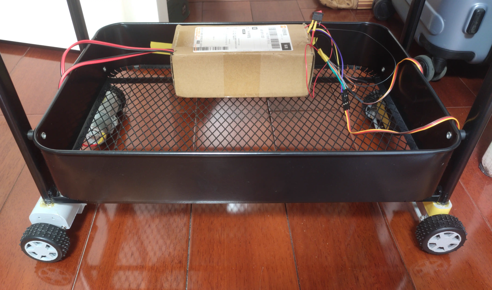

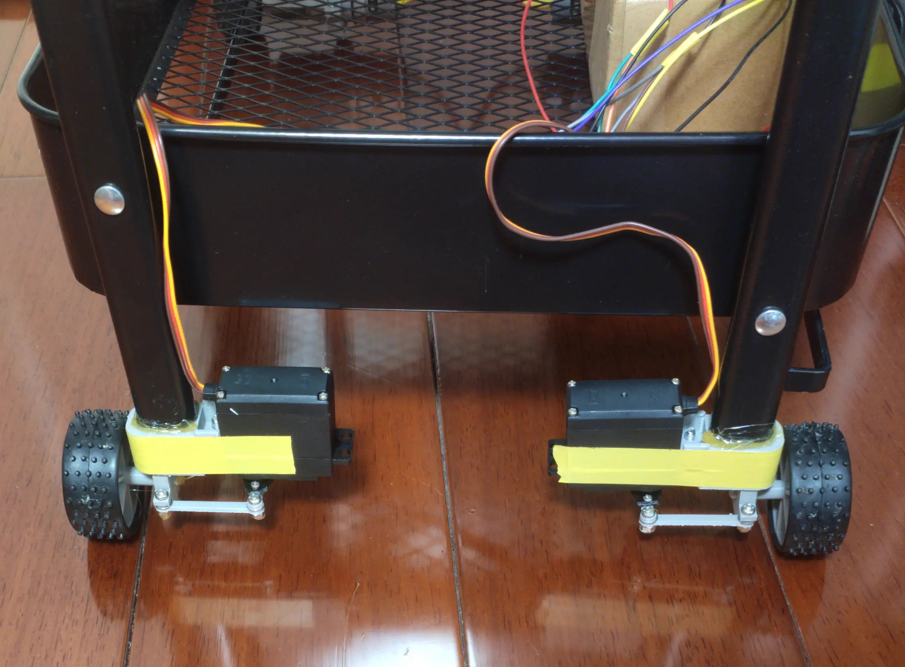

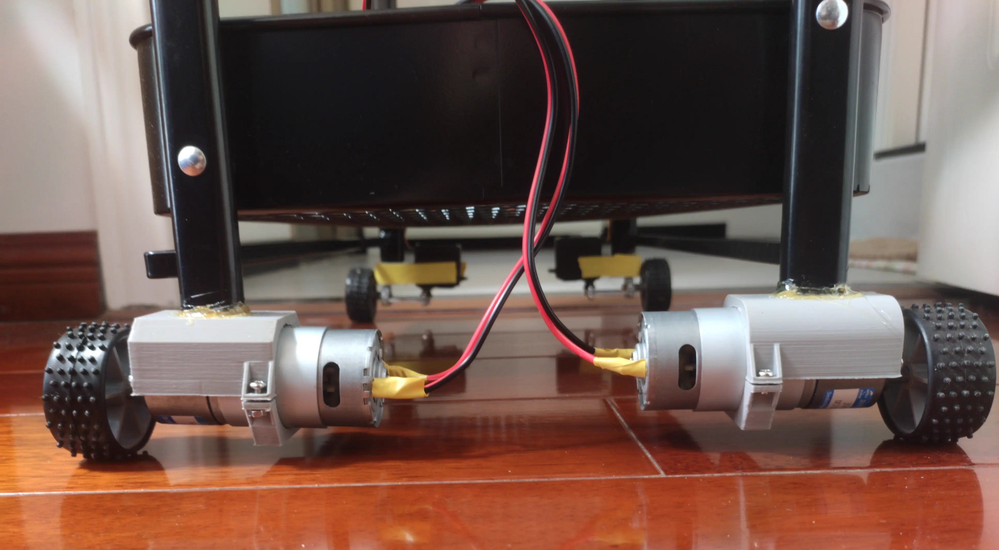

可以看到，左边的电机有点下垂，因为我第一次打印的电机支架并没有很好地适配铁杆的大小，所以有点松。workaround：用一根绳子吊住。

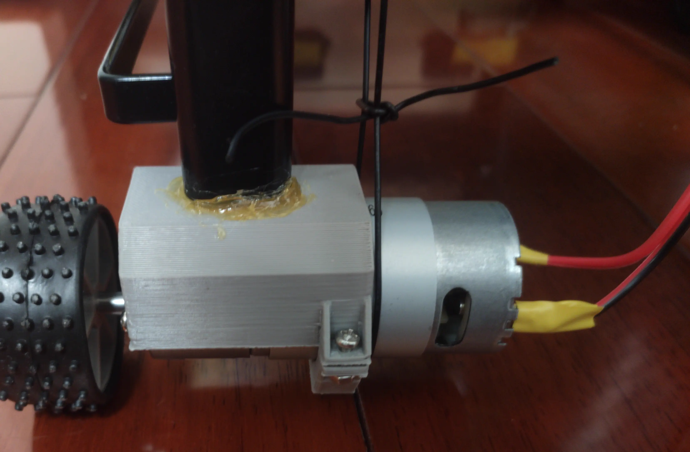

实测，如果把比较重的东西放在第三层，刹车时确实会很抖，放在第二层就好很多。

## 完成！

代码和 FreeCAD 文档都放在 GitHub 的 [BinTianqi/RcRack](https://github.com/BinTianqi/RcRack) 仓库里了。

